<center><h1>C++面向对象</h1></center>

<div style="border-bottom: none;"><center><h3>目录</h3></center></div>

[TOC]

<div style="page-break-after: always;"></div>

# 第1章 C++简介

## 1.1 数据类型

**C++简介**

C++由Bjarne Stroustrup于1979年在贝尔实验室发明，C++在C语言的基础上引起并扩充了面向对象的概念，最初命名为带类的C（C with classes），后更名为C++。C++是C的超集，任何合法的C程序都是合法的C++程序。

C++应用非常广泛，常用于系统开发、引擎开发等领域，支持类、封装、继承、多态等特性。


**Hello World!**

【代码】Hello World!

```c++
#include <iostream>

using namespace std;

int main() {
    cout << "Hello world!" << endl;
    return 0;
}
```

> 运行结果

```
Hello World!
```

---

头文件`iostream`库声明了用于在标准输入输出设备上操作的对象，头文件中包含`cin`（标准输入流）、`cout`（标准输出流）、`cerr`（标准错误流）、`clog`（标准日志流）对象。

`using namespace std`告诉编译器使用`std`命名空间，命名空间是C++中新的概念。


**关键字**

C++中的关键字不能作为常量名、变量名、或其它标识符名称。

|    关键字    |                  |          |         |           |
| :----------: | :--------------: | :------: | :-----: | :-------: |
|     asm      |       else       |   new    |  this   |   auto    |
|     enum     |     operator     |  throw   |  bool   | explicit  |
|   private    |       true       |  break   | export  | protected |
|     try      |       case       |  extern  | public  |  typedef  |
|    catch     |      false       | register | typeid  |   char    |
|    float     | reinterpret_cast | typename |  class  |    for    |
|    return    |      union       |  const   | friend  |   short   |
|   unsigned   |    const_cast    |   goto   | signed  |   using   |
|   continue   |        if        |  sizeof  | virtual |  default  |
|    inline    |      static      |   void   | delete  |    int    |
| static_cast  |     volatile     |    do    |  long   |  struct   |
|   wchar_t    |      double      | mutable  | switch  |   while   |
| dynamic_cast |    namespace     | template |         |           |


**数据类型**

一些基本数据类型可以使用`signed`和`unsigned`修饰符进行修饰。

|        类型        | 占用内存 |                       范围                        |
| :----------------: | :------: | :-----------------------------------------------: |
|        char        |  1字节   |                 $ -128 \sim 127 $​                 |
|   unsigned char    |  1字节   |                  $ 0 \sim 255 $                   |
|    signed char     |  1字节   |                 $ -128 \sim 127 $                 |
|        int         |  4字节   |          $ -2147483648 \sim 2147483647 $          |
|    unsigned int    |  4字节   |               $ 0 \sim 4294967295 $               |
|     signed int     |  4字节   |          $ -2147483648 \sim 2147483647 $          |
|       short        |  2字节   |               $ -32768 \sim 32767 $               |
|   unsigned short   |  2字节   |                 $ 0 \sim 65535 $                  |
|    signed short    |  2字节   |               $ -32768 \sim 32767 $               |
|        long        |  4字节   |          $ -2147483648 \sim 2147483647 $          |
|    signed long     |  4字节   |               $ 0 \sim 4294967295 $               |
|   unsigned long    |  4字节   |          $ -2147483648 \sim 2147483647 $          |
|     long long      |  8字节   | $ -9223372036854775808 \sim 9223372036854775807 $ |
|  signed long long  |  8字节   | $ -9223372036854775808 \sim 9223372036854775807 $ |
| unsigned long long |  8字节   |          $ 0 \sim 18446744073709551615 $          |
|       float        |  4字节   |              $ -3.4e38 \sim 3.4e38 $              |
|       double       |  8字节   |            $ -1..7e308 \sim 1.7e308 $             |

【代码】数据类型

```c++
#include <iostream>
#include <limits>

using namespace std;

int main() {
    cout << "int" << endl;
    cout << "size: " << sizeof(int) << endl;
    cout << "min: " << numeric_limits<int>::min() << endl;
    cout << "max: " << numeric_limits<int>::max() << endl;
    cout << "---------------------------------" << endl;
    cout << "short" << endl;
    cout << "size: " << sizeof(short) << endl;
    cout << "min: " << numeric_limits<short>::min() << endl;
    cout << "max: " << numeric_limits<short>::max() << endl;
    cout << "---------------------------------" << endl;
    cout << "long" << endl;
    cout << "size: " << sizeof(long) << endl;
    cout << "min: " << numeric_limits<long>::min() << endl;
    cout << "max: " << numeric_limits<long>::max() << endl;
    cout << "---------------------------------" << endl;
    cout << "long long" << endl;
    cout << "size: " << sizeof(long long) << endl;
    cout << "min: " 
         << numeric_limits<long long>::min() << endl;
    cout << "max: "
         << numeric_limits<long long>::max() << endl;
    cout << "---------------------------------" << endl;
    cout << "float" << endl;
    cout << "size: " << sizeof(float) << endl;
    cout << "min: " << numeric_limits<float>::min() << endl;
    cout << "max: " << numeric_limits<float>::max() << endl;
    cout << "---------------------------------" << endl;
    cout << "double" << endl;
    cout << "size: " << sizeof(double) << endl;
    cout << "min: " << numeric_limits<double>::min() << endl;
    cout << "max: " << numeric_limits<double>::max() << endl;
    cout << "---------------------------------" << endl;
    cout << "char" << endl;
    cout << "size: " << sizeof(char) << endl;
    cout << "---------------------------------" << endl;
    cout << "bool" << endl;
    cout << "size: " << sizeof(bool) << endl;
    cout << "min: " << numeric_limits<bool>::min() << endl;
    cout << "max: " << numeric_limits<bool>::max() << endl;
    cout << "---------------------------------" << endl;

    return 0;
}
```

> 运行结果

```
int
size: 4
min: -2147483648
max: 2147483647
---------------------------------
short
size: 2
min: -32768
max: 32767
---------------------------------
long
size: 4
min: -2147483648
max: 2147483647
---------------------------------
long long
size: 8
min: -9223372036854775808
max: 9223372036854775807
---------------------------------
float
size: 4
min: 1.17549e-38
max: 3.40282e+38
---------------------------------
double
size: 8
min: 2.22507e-308
max: 1.79769e+308
---------------------------------
char
size: 1
---------------------------------
bool
size: 1
min: 0
max: 1
---------------------------------
```


**存储类别**

存储类别指数据在内存中的存储方法，包含`auto`、`static`、`register`和`extern`四种。

`auto`为普通局部栈变量，这种对象会自动创建和销毁。在调用函数时分配内存，函数结束时释放内存。`auto`为默认存储类别，程序中的变量大多都是`auto`变量。

`static`为静态变量，在函数内定义，它的生命周期为整个源程序，但是其作用域仍与自动变量相同，只能在定义该变量的函数内使用。退出该函数后，尽管该变量还继续存在，但不能使用它。当再次调用该函数时此局部静态变量的值依然保持最后一次的值不变。static变量如未赋初值，则由系统自动赋0。

---

【代码】static

```c++
#include <iostream>

using namespace std;

void foo() {
    static int n = 1;
    cout << "n = " << n << endl;
    n++;
}

int main() {
    for(int i = 0; i < 5; i++) {
        foo();
    }
    return 0;
}
```

> 运行结果

```
n = 1
n = 2
n = 3
n = 4
n = 5
```

---

`register`表示寄存器变量，用于请求编译器将这个变量保存在CPU的寄存器中，从而加快程序的运行。系统的寄存器是有限制的，一些被频繁使用的变量可以使用`register`修饰。不过现在的编译器优化性较强，因此一般不必使用`register`。

`extern`表示外部变量，用于引用在外部定义的变量或函数。

---

【代码】extern

- extern_variable.cpp

```c++
#include <iostream>

using namespace std;

int n = 123;

void foo() {
    cout << "foo()::n = " << n << endl;
}
```

- extern.cpp

```c++
#include <iostream>

using namespace std;

extern int n;
extern void foo();

int main() {
    cout << n << endl;
    foo();
    return 0;
}
```

> 运行结果

```
123
foo()::n = 123
```

---

`volatile`表明某个变量的值可能会随时被外部改变，因此这个变量的存取不能被缓存到寄存器，每次使用需要重新读取。

假如变量flag = true，有两个线程T1和T2访问变量flag。T1把flag改成了false后，T2读取flag。T2此时读到的值可能不是false，因为T1修改flag的这一操作，对T2是不可见的。产生这个情况的原因可能是，T2线程为了提升性能，虚拟机把flag变量存入了寄存器，这样就会导致无论T2读取多少次flag，值始终为true，因为T2读取了寄存器而非内存中的值。

声明了`volatile`或`synchronized`后，确保T2始终从内存中读取变量，T1始终在内存中修改变量。这样就可以保证可见性，防止脏读。

<div style="page-break-after: always;"></div>

## 1.2 命名空间

**命名空间（namespace）**

多人共同开发时，经常会出现变量和函数定义冲突，例如编写了相同名称的函数。命名空间用于解决这个问题，它可以作为附加信息来区分不同库中的变量和函数。

`namespace`表示了标识符的可见范围，C++标准库中的所有标识符都定义于一个名为`std`的namespace中。如果不使用`using namespace std`，就必须使用`std::cout`、`std::endl`等表示其中的标识符。

---

【代码】命名空间

```c++
#include <iostream>

namespace foo {
    int n = 123;
    void f() {
        std::cout << "foo::f()" << std::endl;
    }
};

namespace bar {
    int n = 456;
    void f() {
        std::cout << "bar::f()" << std::endl;
    }
};

int main() {
    std::cout << foo::n << std::endl;
    foo::f();
    std::cout << bar::n << std::endl;
    bar::f();
    return 0;
}
```

> 运行结果

```
123
foo::f()
456
bar::f()
```

<div style="page-break-after: always;"></div>

## 1.3 结构体与共同体

**结构体**

结构体是一种用户自定义的数据类型，它允许存储不同类型的数据项。结构体的声明使用关键字`struct`，声明通常定义为全局变量，这样就可以被多个函数所使用的了。

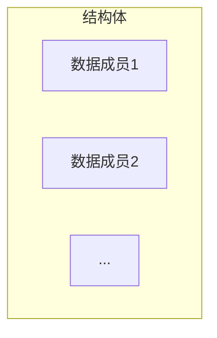

通过成员运算符`.`可以访问一个结构体之中的成员变量。

关键字`typedef`可以用来给数据类型定义别名，通过使用`typedef`可以简化结构体的声明，不用每次都加上`struct`关键字了。

---

【代码】结构体

```c++
#include <iostream>

using namespace std;

typedef struct {
    int year;
    int month;
    int day;
} Date;

int main() {
    Date date;
    date.year = 2021;
    date.month = 8;
    date.day = 11;
    cout << date.year << "/"
         << date.month << "/"
         << date.day << endl;
    return 0;
}
```

> 运行结果

```
2021/8/11
```

---

结构体也可以作为函数参数进行传递。如果是按值传递，那么在函数中会新创建一个结构体变量，并复制调用者的结构体的值。如果是按址传递，则需要传递结构体的指针。

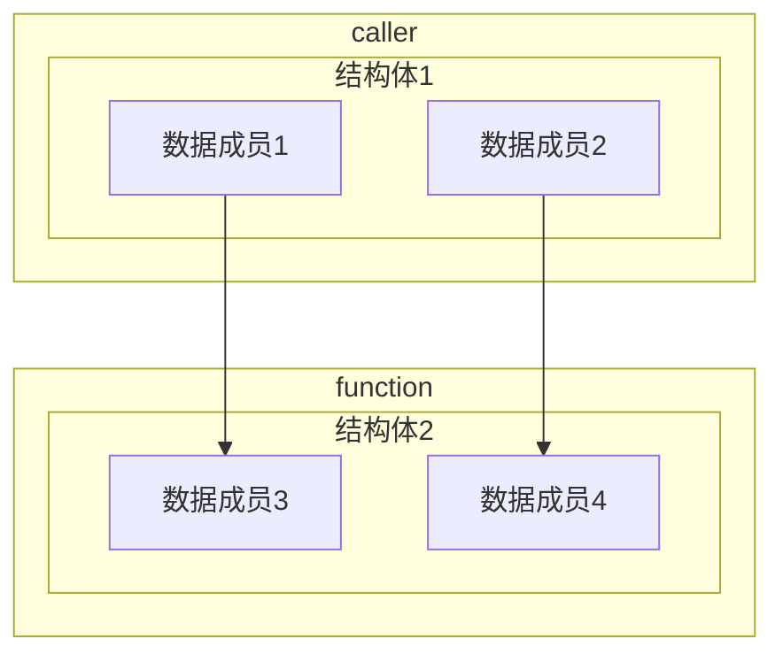

间接引用运算符`->`可以直接访问结构体指针所指的结构变量中的成员。


**共同体**

在存储多个成员信息时，编译器会自动给`struct`每个成员分配存储空间，`struct`可以存储多个成员信息。而`union`每个成员会用同一个存储空间，只能存储一个成员的信息。

在任何同一时刻，`union`只存放了一个被先选中的成员，而结构体的所有成员都存在。对于`union`的不同成员赋值，将会对其它成员重写，原来成员的值就不存在了，而对于`struct`的不同成员赋值是互不影响的。

---

【代码】共同体

```c++
#include <iostream>

using namespace std;

typedef union {
    int n;
    char str[sizeof(int)];
} Data;

int main() {
    Data data;
    data.n = 1;     // 高字节00 00 00 01低字节
    
    // 大端：数据的高字节存储在低地址中，低字节在高地址中
    // 低地址 00 00 00 01 高地址
    // 小端：数据的低字节存储在低地址中，高字节在高地址中
    // 低地址 01 00 00 00 高地址
    if(data.str[sizeof(int)-1] == 1) {
        cout << "big endian" << endl;
    } else {
        cout << "little endian" << endl;
    }
    return 0;
}
```

> 运行结果

```
little endian
```

<div style="page-break-after: always;"></div>

## 1.4 常量指针与指针常量

**常（量）指针**

常（量）指针是指在定义指针变量时，在数据类型前用`const`修饰。

定义一个常指针后，就不能通过指针去更改所指向的变量的值，但是指针的指向可以改变。

---

【代码】常指针

```c++
#include <iostream>

using namespace std;

int main() {
    int a = 123;
    const int *p = &a;  // 等价于int const *p
    *p = 456;
    return 0;
}
```

> 运行结果

```
error: assignment of read-only location '* p'
```


**指针常量**

指针常量是指在定义指针时，在指针变量前用`const`修饰。

指针常量不允许修改，必须要在定义时初始化，之后不能修改指针的指向。

---

【代码】指针常量

```c++
#include <iostream>

using namespace std;

int main() {
    int a = 123;
    int b = 456;
    int * const p = &a;
    p = &b;
    return 0;
}
```

> 运行结果

```
error: assignment of read-only variable 'p'
```


**常指针常量**

常指针常量表示指针的指向不能改变，同时指针指向的值也不能改变。

---

【代码】常指针常量

```c++
#include <iostream>

using namespace std;

int main() {
    int a = 123;
    int b = 456;
    const int * const p = &a;   // 等价于int const * const p
    *p = 789;
    p = &b;
    return 0;
}
```

> 运行结果

```
error: assignment of read-only location '*(const int*)p'
error: assignment of read-only variable 'p'
```

<div style="page-break-after: always;"></div>

## 1.5 内联函数

**内联函数（Inline Function）**

内联函数是在编译时期展开，不用执行进入函数的步骤，直接执行函数体,相当于把内联函数里面的内容写在调用内联函数处。编译器一般不内联包含循环、递归、switch等复杂操作的函数。是否内联，程序员不可控，内联函数只是对编译器的建议，是否对函数内联，决定权在于编译器。

---

【代码】内联函数

```c++
#include <iostream>

using namespace std;

inline int max(int num1, int num2) {
    return num1 > num2 ? num1 : num2;
}

int main() {
    cout << max(92, 28) << endl;
    return 0;
}
```

> 运行结果

```
92
```

---

编译器对内联函数的处理首先是将内联函数复制到调用处，并为局部变量分配内存，将输入参数和返回值映射到局部变量空间中。如果内联函数有多个返回点，将会使用goto语句跳转到代码块的末尾。

使用内联函数的优点在于同宏函数一样将在被调用处进行代码展开，省去了参数压栈、栈帧开辟与回收，结果返回等，从而提高程序运行速度。并且内联函数相比宏函数来说，在代码展开时，会做安全检查或自动类型转换，而宏定义则不会。在类中声明同时定义的成员函数，自动转化为内联函数，因此内联函数可以访问类的成员变量。

但是内联是以代码膨胀（复制）为代价，消除函数调用带来的开销，每一处内联函数的调用都要复制代码，将使程序的总代码量增大，消耗更多的内存空间。并且内联函数无法随着函数库的升级而升级，内联函数的改变需要重新编译，不像普通函数可以直接链接。

<div style="page-break-after: always;"></div>

## 1.6 重载函数

**函数默认参数**

在进行函数参数定义的时候，也可以设置默认值。当参数没有传递的时候就利用默认值来进行参数内容的填充，如果在参数上定义了默认值，那么该参数一定要放在参数列表的最后。

---

【代码】函数默认参数

```c++
#include <iostream>

using namespace std;

void setDate(int year = 1970, int month = 1, int day = 1) {
    cout << year << "/" << month << "/" << day << endl;
}

int main() {
    setDate(2021, 8, 15);
    setDate(2021, 7);
    setDate(2021);
    setDate();
    return 0;
}
```

> 运行结果

```
2021/8/15
2021/7/1
2021/1/1
1970/1/1
```


**重载函数**

重载（overload）表示在同一个作用域中声明了一个与之前声明过的函数具有相同名称的函数，但是它们的参数列表不同。当调用一个重载函数时，编译器通过传递的参数类型，选用最合适的定义。

---

【代码】重载函数

```c++
#include <iostream>

using namespace std;

int max(int num1, int num2) {
    return num1 > num2 ? num1 : num2;
}

double max(double num1, double num2) {
    return num1 > num2 ? num1 : num2;
}

char max(char num1, char num2) {
    return num1 > num2 ? num1 : num2;
}

int main() {
    cout << max(2, 8) << endl;
    cout << max(3.14, 2.71) << endl;
    cout << max('H', 'D') << endl;
    return 0;
}
```

> 运行结果

```
8
3.14
H
```

<div style="page-break-after: always;"></div>

## 1.7 引用

**引用（Reference）**

在C语言中`&`表示取地址符，但是在C++中还有`引用`的特性。引用是指对某一变量的别名，因此引用本身并不占存储单元，对引用的操作与直接对变量的操作完全一样。

```c++
data_type &ref_var = var;
```

声明引用时必须对其初始化，并且之后不能再将该引用作为其它变量的别名。

引用的一个重要作用就是作为函数的参数。C语言中函数参数传递是按值传递，如果有大块数据作为参数传递的时候，往往采用指针的方式，因为这样可以避免将整块数据全部压栈，可以提高程序的效率。但是C++中传递引用给函数与传递指针的效果是一样的，使用引用传递函数的参数，在内存中并没有产生实参的副本，而是直接对实参操作。

---

【代码】引用

```c++
#include <iostream>

using namespace std;

void swap(int& num1, int& num2) {
    int temp = num1;
    num1 = num2;
    num2 = temp;
}

int main() {
    int a = 92;
    int b = 28;
    cout << "Before: " << a << " " << b << endl;
    swap(a, b);
    cout << "After: " << a << " " << b << endl;
    return 0;
}
```

> 运行结果

```
Before: 92 28
After: 28 92
```


**指针与引用的区别**

1. 指针有自己的一块空间，而引用只是一个别名，对引用的操作等效于对原变量的操作。
2. 指针的大小为4或8（根据OS），而引用则是被引用对象的大小。
3. 指针可以被初始化为`NULL`，而引用必须被初始化且必须是一个已有对象的引用。
4. 作为参数传递时，指针需要被解引用才可以对对象进行操作，而直接对引用的修改都会改变引用所指向的对象。
5. 引用在初始化后，便不能再更改引用的目标。
6. 指针可以有多级指针，而引用只有一级。
7. 指针和引用使用`++`运算符的意义不一样。
8. 返回动态内存分配的内存时必须使用指针，引用可能引起内存泄漏。

<div style="page-break-after: always;"></div>

## 1.8 函数指针

**函数指针**

函数指针即指向函数的指针，它最大的作用是把一个函数作为参数传递给另外一个函数。在编译时，每一个函数都有一个入口地址，该入口地址就是函数指针所指向的地址。

---

【代码】函数指针

```c++
#include <iostream>

using namespace std;

int add(int num1, int num2) {
    return num1 + num2;
}

int sub(int num1, int num2) {
    return num1 - num2;
}

int get(int num1, int num2, int (*calculate)(int num1, int num2)) {
    return calculate(num1, num2);
}

int main() {
    cout << get(7, 3, add) << endl;
    cout << get(7, 3, sub) << endl;
    return 0;
}
```

> 运行结果

```
10
4
```


**回调函数（Callback Function）**

假设公司要开发一款主打解决国民早餐问题的APP`明日油条`，为了加快开发进度，这款应用由`A小组`和`B小组`协同开发。

其中有一个核心模块由`A小组`开发供`B小组`调用，这个核心模块被写成了一个函数`make_youtiao()`。

如果`make_youtiao()`执行地很快并可以立即返回，那么`B小组`只需：

1. 调用`make_youtiao()`
2. 等待函数执行完成
3. 执行后续流程`sell()`出售


但是现实中`make_youtiao()`函数需要处理的数据非常庞大，例如`make_youtiao(10000)`不会立刻返回，而是需要等待10分钟才能执行完成。显然直接调用的话，需要等待10分钟后才能继续执行后续代码，这并不是一种高效的做法。

因此一种更好的做法是调用`make_youtiao()`后不再等待这个函数执行完成，而是让这个函数知道制作完油条后该干什么，例如`制作10000个油条，然后卖出去`。

因此`make_youtiao()`需要增加一个参数，除了指定制作油条的数量外，还可以指定制作好后该干什么，这个被`make_youtiao()`调用的函数就叫回调。

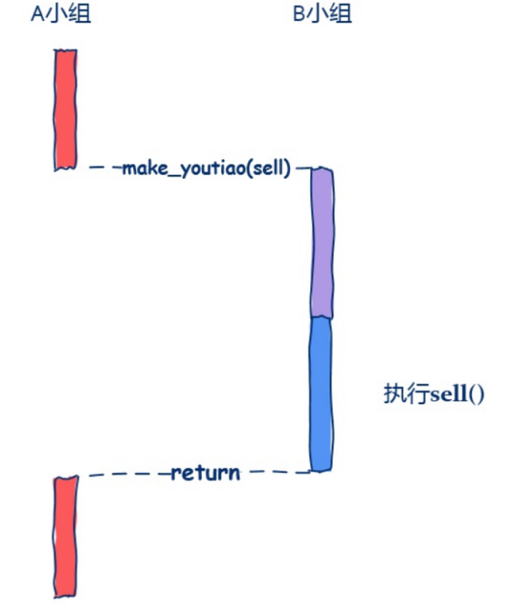

【代码】回调函数

```c++
#include <iostream>

using namespace std;

void sell(int n) {
    cout << "selling youtiao ..." << endl;
}

void make_youtiao(int n, void (*sell)(int)) {
    cout << "making youtiao ..." << endl;
    for(int i = 0; i < n; i++);
    sell(n);
}

int main() {
    make_youtiao(10000, sell);
    return 0;
}
```

> 运行结果

```
making youtiao ...
selling youtiao ...
```

<div style="page-break-after: always;"></div>

## 1.9 内存管理

**malloc() / free()**

C语言使用`malloc()`分配内存，使用`free()`释放已分配的内存。当`malloc()`分配的内存过多/不够时，可以使用`realloc()`重新分配内存。

`malloc()`的功能是向系统申请指定的内存空间（以字节为单位），使用该函数需要包含头文件`stdlib.h`。

`malloc()`函数原型：

```c
void* malloc(size_t size);
```

`malloc()`的返回值为`void *`类型，表示一个指向申请到的空间的首地址，是一个无类型的指针，开发者需要自行转换为自己需要的类型。如果`malloc()`申请内存失败，则会返回空指针`NULL`。

通过`malloc()`申请来的空间是需要归还给操作系统的，否则程序长时间运行内存会逐渐下降。通过`free()`可以把申请来的空间释放，但是有两点需要注意：

1. 只能释放通过`malloc()`申请得到的空间
2. 只能通过空间的首地址进行释放

---

【代码】malloc() / free()

```c++
#include <iostream>
#include <cstdlib>

using namespace std;

int main() {
    const int n = 10;
    int *arr = (int *)malloc(sizeof(int) * n);
    if(!arr) {
        cerr << "Memory allocation failed." << endl;
        return 1;
    }
    for(int i = 0; i < n; i++) {
        arr[i] = i;
        cout << arr[i] << " ";
    }
    cout << endl;
    free(arr);
    return 0;
}
```

> 运行结果

```
0 1 2 3 4 5 6 7 8 9
```


**new / delete**

C++中可以通过`new`运算符实现动态内存分配，如果空间内配失败，程序则抛出`bad_alloc`异常。

```c++
T *p = new T;
T *p = new T[N];
```

> T：任意类型名
>
>  p：类型为T *的指针

通过动态内存分配所得的空间在使用完后需要使用`delete`运算符释放空间。

```c++
delete p;
delete[] p;
```

如果动态分配了一个数组，但是却用`delete`释放，而不是`delete[]`，会导致动态分配的数据没有被完全释放。如果动态申请的内存空间不再使用后没有及时释放，就会导致内存泄漏（memory leak）。

---

【代码】new / delete

```c++
#include <iostream>

using namespace std;

int main() {
    int *p1 = new int;
    *p1 = 928;
    cout << "*p1 = " << *p1 << endl;

    const int n = 10;
    int *p2 = new int[n];
    cout << "p2: ";
    for(int i = 0; i < n; i++) {
        p2[i] = i;
        cout << p2[i] << " ";
    }
    cout << endl;

    delete p1;
    delete[] p2;
    return 0;
}
```

> 运行结果

```
*p1 = 928
p2: 0 1 2 3 4 5 6 7 8 9
```


**malloc() / free()与new / delete区别**

1. `new`分配内存按照数据类型，而`malloc()`按照指定指定大小。
2. `new`返回指定对象的指针，而`malloc()`返回`void *`，因此`malloc()`的返回值一般都需要类型转换。
3. `new`分配的空间要用`delete`销毁，而`malloc()`要用`free()`销毁。
4. `new`是一个操作符，`malloc()`是一个库函数。
5. `new`分配失败抛出`bad_alloc`异常，而*malloc()*失败返回`NULL`。


**内存管理**

虚拟内存中栈区的内存是由系统自动分配的，不需要程序员对其进行管理，一般用于存储函数的返回地址、参数、局部变量和返回值。而堆区的内存是动态分配的，并且需要手动释放内存。

栈是运行时的单位，堆是存储的单位。栈解决程序运行问题（如何执行），堆解决数据存储的问题（如何存储）。

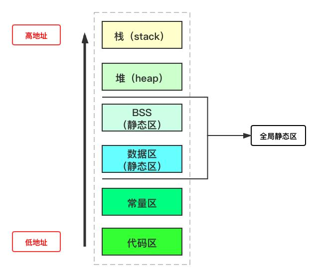

<div style="page-break-after: always;"></div>

# 第2章 封装

## 2.1 面向过程与面向对象

**面向过程（Procedure Oriented）**

面向过程是一种以过程为中心的编程思想，以什么正在发生为主要目标进行编程，分析出解决问题所需要的步骤，然后用函数把这些步骤一步一步实现，使用的时候一个一个依次调用。

C语言就是一种面向过程的编程语言，但是面向过程的缺陷是数据和函数并不完全独立，使用两个不同的实体表示信息及其操作。


**面向对象（Object Oriented）**

面向对象是相对于面向过程来讲的，面向对象方法把相关的数据和方法组织为一个整体来看待，从更高的层次来进行系统建模，更贴近事物的自然运行模式。

在面向对象中，把构成问题的事物分解成各个对象，建立对象的目的不是为了完成一个步骤，而是为了描叙某个事物在整个解决问题的步骤中的行为。

Java、C++、Python等都是面向对象的编程语言，面向对象的优势在于只是用一个实体就能同时表示信息及其操作。

面向对象三大特性：

1. 封装（encapsulation）：数据和代码捆绑，避免外界干扰和不确定性访问。
2. 继承（inheritance）：让某种类型对象获得另一类型对象的属性和方法。
3. 多态（polymorphism）：同一事物表现出不同事物的能力。

<div style="page-break-after: always;"></div>

## 2.2 类和对象

**类和对象**

类（class）表示同一类具有相同特征和行为的对象的集合，类定义了对象的属性和方法。

对象（object）是类的实例，对象拥有属性和方法。

类的设计需要使用关键字`class`，类名是一个标识符，遵循大驼峰命名法。类中可以包含属性和方法。其中，属性通过变量表示，又称实例变量；方法用于描述行为，又称实例方法。


【代码】类和对象

```c++
#include <iostream>
#include <string>

using namespace std;

class Person {
public:
    string name;
    int age;

    void eat() {
        cout << "吃饭" << endl;
    }

    void sleep() {
        cout << "睡觉" << endl;
    }
};

int main() {
    Person person;

    person.name = "小灰";
    person.age = 17;
    cout << "姓名：" << person.name << endl;
    cout << "年龄：" << person.age << endl;

    person.eat();
    person.sleep();
    return 0;
}
```

> 运行结果

```
姓名：小灰
年龄：17
吃饭
睡觉
```

<div style="page-break-after: always;"></div>

## 2.3 封装

**封装（Encapsulation）**

封装是面向对象方法的重要原则，就是把对象的属性和方法结合为一个独立的整体，并尽可能隐藏对象的内部实现细节。

封装可以认为是一个保护屏障，防止该类的数据被外部类随意访问。要访问该类的数据，必须通过严格的接口控制。合适的封装可以让代码更容易理解和维护，也加强了程序的安全性。

实现封装的步骤：

1. 修改属性的可见性来限制对属性的访问，一般限制为`private`。
2. 对每个属性提供对外的公共方法访问，也就是提供一对`setter / getter`，用于对私有属性的访问。


**访问权限**

属性和方法的访问权限一般分为3种：

1. `public`：属性和方法在类的内部和外部都可以访问。
2. `private`：属性和方法只能在类内访问。
3. `protected`：属性和方法只能在类的内部和其派生类中访问。


**this指针**

每一个对象都能通过`this`指针来访问自身的地址，`this`指针是所有成员方法的隐含参数，在成员方法内部可以用来指向调用对象。

在类中，属性的名字可以和局部变量的名字相同。此时，如果直接使用名字来访问，优先访问的是局部变量。因此，需要使用`this`指针来访问当前对象的属性。

当需要访问的属性与局部变量没有重名的时候，`this`可以省略。

---

【代码】封装

```c++
#include <iostream>
#include <string>

using namespace std;

class Person {
public:
    void setName(string name) {
        this->name = name;
    }

    string getName() {
        return name;
    }

    void setAge(int age) {
        this->age = age;
    }

    int getAge() {
        return age;
    }

private:
    string name;
    int age;
};

int main() {
    Person person;

    person.setName("小灰");
    person.setAge(17);

    cout << "姓名：" << person.getName() << endl;
    cout << "年龄：" << person.getAge() << endl;
    return 0;
}
```

> 运行结果

```
姓名：小灰
年龄：17
```

<div style="page-break-after: always;"></div>

## 2.4 构造函数与析构函数

**构造函数（Constructor）**

构造函数也是一个函数，用于实例化对象，在实例化对象的时候调用。一般情况下，使用构造函数是为了在实例化对象的同时，给一些属性进行初始化赋值。

构造函数和普通函数的区别：

1. 构造函数的名字必须和类名一致。
2. 构造函数没有返回值，返回值类型部分不写。

如果一个类中没有构造函数，系统会自动提供一个public权限的无参构造函数以便实例化对象。如果一个类中已有构造函数，系统将不再提供任何默认的构造函数。

---

【代码】构造函数

```c++
#include <iostream>
#include <string>

using namespace std;

class Person {
public:
    Person();
    Person(string name, int age);
    string toString();

private:
    string name;
    int age;
};

// 无参构造函数
Person::Person() {
    cout << "Person::Person()" << endl;
}

// 有参构造函数
Person::Person(string name, int age) {
    cout << "Person::Person(string, int)" << endl;
    this->name = name;
    this->age = age;
}

string Person::toString() {
    return "姓名：" + name + "，年龄：" + to_string(age);
}

int main() {
    Person p1;
    Person p2("小灰", 17);
    cout << p2.toString() << endl;    
    return 0;
}
```

> 运行结果

```
Person::Person()
Person::Person(string, int)
姓名：小灰，年龄：17
```


**初始化列表**

与其它函数不同，构造函数还可以有初始化列表。初始化列表以`:`开头，后跟一些列以逗号分割的初始化字段。

---

【代码】初始化列表

```c++
#include <iostream>
#include <string>

using namespace std;

class Person {
public:
    Person(string name, int age);
    string toString();

private:
    string name;
    int age;
};

Person::Person(string name, int age) : name(name), age(age) {
    cout << "Person::Person(string, int)" << endl;
}

string Person::toString() {
    return "姓名：" + name + "，年龄：" + to_string(age);
}

int main() {
    Person person("小灰", 17);
    cout << person.toString() << endl;    
    return 0;
}
```

> 运行结果

```
Person::Person(string, int)
姓名：小灰，年龄：17
```

---

有些时候初始化列表是不可或缺的，以下情况必须使用初始化列表：

1. 常量成员：常量只能初始化不能赋值。
2. 引用类型：引用必须在定义时初始化，且不能重新赋值。
3. 没有默认构造函数的类类型：使用初始化列表可以不必调用默认构造函数来初始化，而是直接调用拷贝构造函数初始化。


**析构函数（Destructor）**

析构函数与构造函数相反，当对象的生命周期结束时，会自动执行析构函数，用于做清理善后的事情。

析构函数的名称以`~`为前缀，后加类名称，它没有返回值和参数。

---

【代码】析构函数

```c++
#include <iostream>
#include <string>

using namespace std;

class Person {
public:
    Person(string name, int age);
    ~Person();

private:
    string name;
    int age;
};

Person::Person(string name, int age) : name(name), age(age) {
    cout << "Person::Person(string, int)" << endl;
}

Person::~Person() {
    cout << "Person::~Person()" << endl;
}

int main() {
    Person p1("小灰", 17);
    Person *p2 = new Person("小白", 21);
    delete p2;
    return 0;
}
```

> 运行结果

```
Person::Person(string, int)
Person::Person(string, int)
Person::~Person()
Person::~Person()
```


**拷贝构造函数（Copy Constructor）**

拷贝构造函数是构造函数的一种，它只有一个参数，参数类型为本类的引用。参数可以使`const`引用，也可以是非`const`引用，但是一般使用前者。

如果没有编写拷贝构造函数，编译器会自动生成一个默认的拷贝构造函数。

---

【代码】拷贝构造函数

```c++
#include <iostream>
#include <string>

using namespace std;

class Person {
public:
    Person(const Person &p);
    Person(string name, int age);

private:
    string name;
    int age;
};

Person::Person(const Person &p) {
    cout << "Person::Person(const Person &)" << endl;
    this->name = p.name;
    this->age = p.age;
}

Person::Person(string name, int age) {
    cout << "Person::Person(string, int)" << endl;
    this->name = name;
    this->age = age;
}

int main() {
    Person p1("小灰", 17);
    Person p2(p1);
    Person p3 = p1;
    return 0;
}
```

> 运行结果

```
Person::Person(string, int)
Person::Person(const Person &)
Person::Person(const Person &)
```

---

拷贝构造函数会在3种情况下被调用：

1. 用一个对象去初始化同类的另一个对象。
2. 函数参数是类的对象。
3. 函数的返回值是类的对象。


**浅拷贝 / 深拷贝**

当使用浅拷贝（shallow copy）时，仅仅是拷贝指针字面值，如果原来的对象调用析构函数释放掉指针所指向的数据，则会产生空悬指针（dangling pointer），因为所指向的内存空间已经被释放了。

---

【代码】浅拷贝

```c++
#include <iostream>

using namespace std;

class User {
public:
    User();
    ~User();
    void printDataAddress();

private:
    int *data;
};

User::User() {
    this->data = new int;
}

User::~User() {
    delete data;
    data = nullptr;
}

void User::printDataAddress() {
    cout << data << endl;
}

int main() {
    User user1;
    user1.printDataAddress();
    User user2(user1);
    user2.printDataAddress();  
    return 0;
}
```

> 运行结果

```
0x26c2b90
0x26c2b90
```

---

深拷贝（deep copy）可以解决浅拷贝出现的问题，通过定义一个拷贝构造函数，当被拷贝对象存在动态分配的存储空间时，需要先动态申请一块存储空间，然后逐字节拷贝内容。

---

【代码】深拷贝

```c++
#include <iostream>

using namespace std;

class User {
public:
    User();
    User(const User& user);
    ~User();
    void printDataAddress();

private:
    int *data;
};

User::User() {
    this->data = new int;
}

User::User(const User& user) {
    this->data = new int;
    *(this->data) = *(user.data);
}

User::~User() {
    delete data;
    data = nullptr;
}

void User::printDataAddress() {
    cout << data << endl;
}

int main() {
    User user1;
    user1.printDataAddress();
    User user2(user1);
    user2.printDataAddress();  
    return 0;
}
```

> 运行结果

```
0x6b17b0
0x6b17d0
```

<div style="page-break-after: always;"></div>

## 2.5 静态成员

**静态成员**

类的静态成员在编译时创建并初始化，在该类的任何对象建立之前就已经存在。静态成员不属于任何对象，并且在类中只有一份，为所有此类对象共享。

在静态成员函数的实现中不能直接引用类中的非静态成员，但可以引用类中的静态成员。如果静态成员函数中要引用非静态成员时，需要通过对象来引用。

---

【代码】静态成员

```c++
#include <iostream>
#include <string>

using namespace std;

class User {
public:
    User(int id, string name) : id(id), name(name) {
        totalUsers++;
    }

    static int getTotalUsers() {
        return totalUsers;
    }

private:
    static int totalUsers;
    int id;
    string name;
};

int User::totalUsers = 0;       // 初始用户数量

int main() {
    cout << User::getTotalUsers() << endl;
    
    for(int i = 0; i < 10; i++) {
        User user(i, "User-" + to_string(i));
    }
    
    cout << User::getTotalUsers() << endl;
    return 0;
}
```

> 运行结果

```
0
10
```

<div style="page-break-after: always;"></div>

## 2.6 友元

**友元函数**

封装使得类的数据对外隐藏，但是有些函数不是类的一部分，却又需要频繁访问类的数据成员，这时可以将这些函数定义为该类的友元函数。一个函数可以是多个类的友元函数，只需要在各个类中分别声明。除了友元函数，还有友元类。

友元（friend）的作用是提高程序的运行效率，减少了类型检查和安全性检查等需要的时间开销，但它破坏了类的封装性和隐藏性，使得非成员函数可以访问类的私有成员。

友元函数是可以直接访问类的私有成员的非成员函数。它是定义在类外的普通函数，它不属于任何类，但需要在类的定义中加以声明。

```c++
friend ret_type func_name([param_list]);
```

---

【代码】友元函数

```c++
#include <iostream>
#include <cmath>

using namespace std;

class Coordinate {
public:
    Coordinate(double x, double y) : x(x), y(y) {};

    friend double distance(Coordinate &c1, Coordinate &c2);

private:
    double x;
    double y;
};

double distance(Coordinate &c1, Coordinate &c2) {
    double deltaX = c1.x - c2.x;
    double deltaY = c1.y - c2.y;
    return sqrt(deltaX * deltaX + deltaY * deltaY);
}

int main() {
    Coordinate c1(3, 5);
    Coordinate c2(4, 6);
    cout << distance(c1, c2) << endl;
    return 0;
}
```

> 运行结果

```
1.41421
```


**友元类**

友元类的所有成员函数都是另一个类的友元函数，可以访问另一个类中的隐藏信息。当一个类想要存取另一个类的私有成员时，可以将该类声明为另一类的友元类。

```c++
friend class class_name;
```

友元有以下需要注意的地方：

1. 友元关系不能被继承。
2. 友元关系是单向的，不具有交换性。如果A是B的友元，B不一定是A的友元。
3. 友元关系不具有传递性。如果A是B的友元，C是A的友元，那么C不一定是B的友元。

<div style="page-break-after: always;"></div>

## 2.7 运算符重载

**运算符重载**

C++中预定义的运算符的操作对象只能是基本数据类型，但实际上对于许多用户自定义类型（例如类），也需要类似的运算操作。这时就必须在C++中重新定义这些运算符，赋予已有运算符新的功能，使它能够用于特定类型执行特定的操作。运算符重载的实质是函数重载，它提供了可扩展性。

运算符重载是通过创建运算符函数实现的，运算符函数定义了重载的运算符将要进行的操作。运算符函数的定义与其它函数的定义类似，惟一的区别是运算符函数的函数名是由关键字`operator`和要重载的运算符符号构成。

```c++
ret_type operator op([param_list]) {
    // code
}
```

运算符重载需要遵循以下规则：

1. 除了`.`、`->`、`sizeof`、`?:`和`#`，其它运算符都可以重载。
2. 重载后的运算符不能改变优先级和结合性，也不能概念运算符的操作数个数及语法结构。
3. 运算符重载是针对新类型数据对实际需要的改造，重载后的运算符应当与原有功能相类似。


**二元运算符重载**

二元运算符需要两个操作数，例如`+`、`-`、`*`、`/`等。

---

【代码】二元运算符重载

```c++
#include <iostream>
#include <string>

using namespace std;

class Complex {
public:
    Complex(int real, int imaginary);
    string getNumber();
    Complex operator+(const Complex& c);

private:
    int real;
    int imaginary;
};

Complex::Complex(int real = 0, int imaginary = 0)
    : real(real), imaginary(imaginary) {}

string Complex::getNumber() {
    return to_string(real) + "+" + to_string(imaginary) + "i";
}

Complex Complex::operator+(const Complex& c) {
    Complex complex;
    complex.real = this->real + c.real;
    complex.imaginary = this->imaginary + c.imaginary;
    return complex;
}

int main() {
    Complex c1(1, 2);
    Complex c2(8, 1);
    Complex result = c1 + c2;
    cout << result.getNumber() << endl;
    return 0;
}
```

> 运行结果

```
9+3i
```


**一元运算符重载**

一元运算符只对一个操作数操作，例如`++`、`--`、`-`、`!`等。

---

【代码】一元运算符重载

```c++
#include <iostream>
#include <string>
#include <iomanip>

using namespace std;

class Time {
public:
    Time(int hour, int minute, int second);
    void display();
    Time operator++();      // 前置++
    Time operator++(int);   // 后置++

private:
    int hour;
    int minute;
    int second;
};

Time::Time(int hour, int minute, int second) 
    : hour(hour), minute(minute), second(second) {}

void Time::display() {
    cout << setfill('0')
         << setw(2) << hour << ":"
         << setw(2) << minute << ":"
         << setw(2) << second << endl;
}

// 前置++
Time Time::operator++() {
    second++;
    if(second == 60) {
        second %= 60;
        minute++;
        if(minute == 60) {
            minute %= 60;
            hour++;
            if(hour == 24) {
                hour = 0;
            }
        }
    }
    return Time(hour, minute, second);
}

// 后置++
Time Time::operator++(int) {
    // 保存原始值
    Time time(hour, minute, second);
    second++;
    if(second == 60) {
        second %= 60;
        minute++;
        if(minute == 60) {
            minute %= 60;
            hour++;
            if(hour == 24) {
                hour = 0;
            }
        }
    }
    return time;    // 返回原始值
}

int main() {
    Time time(9, 21, 58);
    time.display();

    ++time;
    time.display();

    time++;
    time.display();
    return 0;
}
```

> 运行结果

```
09:21:58
09:21:59
09:22:00
```


**输入输出运算符重载**

C++使用流提取运算符`>>`和流插入运算符`<<`进行输入输出，通过运算符重载可以对自定义对象进行输入输出操作。通过把输入输出运算符重载函数声明为类的友元，可以直接调用函数而无需创建对象。

---

【代码】输入输出运算符重载

```c++
#include <iostream>
#include <string>

using namespace std;

class User {
public:
    User(int id, string name);
    friend ostream& operator<<(
        ostream& out,
        const User& user);
    friend istream& operator>>(istream& in, User& user);

private:
    int id;
    string name;
};

User::User(int id = 0, string name = "")
    : id(id), name(name) {}

ostream& operator<<(ostream& out, const User& user) {
    out << "ID: " << to_string(user.id) << ", "
        << "name: " << user.name;
    return out;
}

istream& operator>>(istream& in, User& user) {
    cout << "Enter user ID: ";
    in >> user.id;
    cout << "Enter user name: ";
    in >> user.name;
    return in;
}

int main() {
    User user;
    cin >> user;
    cout << user;
    return 0;
}
```

> 运行结果

```
Enter user ID: 1
Enter user name: Terry
ID: 1, name: Terry
```

<div style="page-break-after: always;"></div>

# 第3章 继承

## 3.1 继承的概念

**继承（Inheritance）**

继承是面向对象的三大特征之一，程序中的继承是类与类之间的特征和行为的一种赠予或获取。两个类之间的继承必须满足`is a`的关系。子类继承自父类，父类也称基类或超类，子类也称派生类。

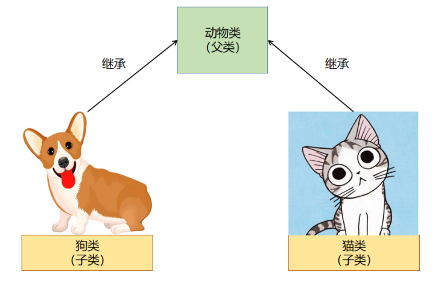

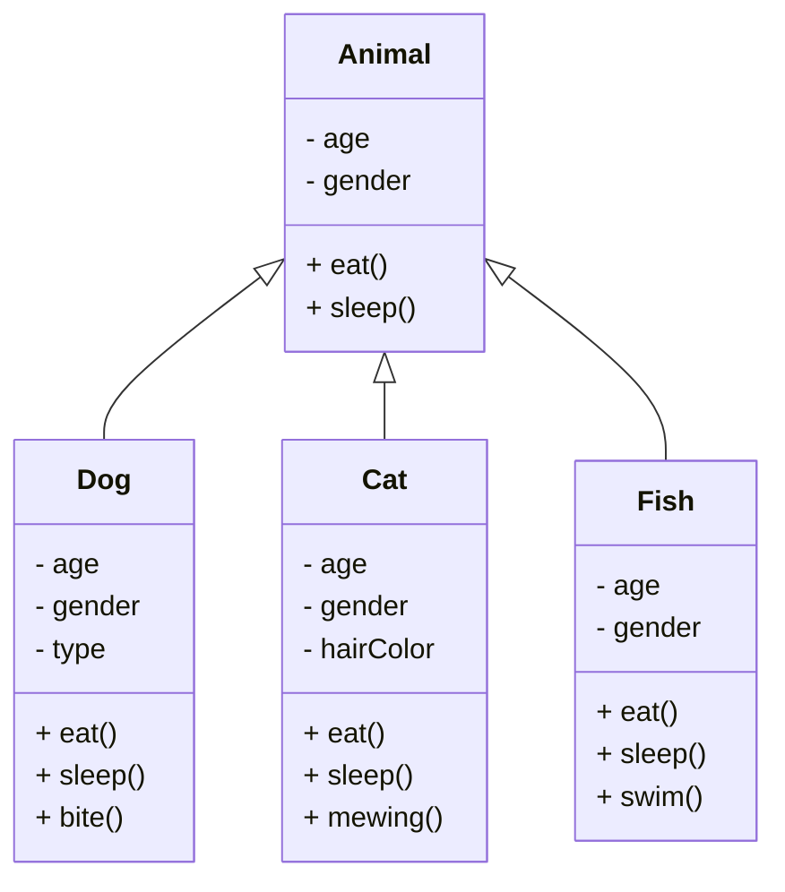

产生继承关系后，子类可以使用父类中的属性和方法，也可以定义子类独有的属性和方法。

```c++
class subclass : access_modifier superclass {
    // code
};
```

继承时通常使用`public`类型。当一个类`public`继承于父类时，父类的`public`成员也是子类的`public`成员，父类的`protected`成员也是子类的`protected`成员，父类的`private`成员不能被继承。

继承的好处是可以提高代码的复用性、提高代码的拓展性。

---

【代码】继承

- animal.h

```c++
#ifndef _ANIMAL_H_
#define _ANIMAL_H_

#include <string>

class Animal {
public:
    Animal(std::string name = "", int age = 0);
    void eat();

private:
    std::string name;
    int age;
};

#endif
```

- animal.cpp

```c++
#include "animal.h"
#include <iostream>

using namespace std;

Animal::Animal(string name, int age)
    : name(name), age(age) {}

void Animal::eat() {
    cout << "eating" << endl;
}
```

- dog.h

```c++
#ifndef _DOG_H
#define _DOG_H_

#include "animal.h"
#include <string>

class Dog : public Animal {
public:
    Dog(std::string name, int age, std::string type = "");
    void bite();
    
private:
    std::string type;
};

#endif
```

- dog.cpp

```c++
#include "dog.h"
#include <iostream>

using namespace std;

Dog::Dog(string name, int age, string type)
    : Animal(name, age), type(type) {}

void Dog::bite() {
    cout << "biting" << endl;
}
```

- test_dog.cpp

```c++
#include <iostream>
#include "dog.h"

using namespace std;

int main() {
    Dog dog("狗子", 3, "哈士奇");
    dog.eat();
    dog.bite();
    return 0;
}
```

> 运行结果

```
eating
biting
```

<div style="page-break-after: always;"></div>

## 3.2 多继承

**多继承**

C++支持多继承，即一个子类可以有两个或更多个父类。多继承时通过使用逗号将多个父类隔开，每个父类都可以用不同访问限定符修饰。

当多个父类中有同名的成员时，就会产生命名冲突，因此这时就需要在成员前加上类名和域限定符`::`消除二义性。

---

【代码】多继承

- date.h

```c++
#ifndef _DATE_H_
#define _DATE_H_

#include <string>

class Date {
public:
    Date(int year = 1970, int month = 1, int day = 1);
    std::string getDate();

private:
    int year;
    int month;
    int day;
};

#endif
```

- date.cpp

```c++
#include "date.h"

using namespace std;

Date::Date(int year, int month, int day)
    : year(year), month(month), day(day) {}

string Date::getDate() {
    char format[128];
    snprintf(format, sizeof(format), 
            "%04d/%02d/%02d", year, month, day);
    string dateStr(format);
    return dateStr;
}
```

- time.h

```c++
#ifndef _TIME_H_
#define _TIME_H_

#include <string>

class Time {
public:
    Time(int hour = 0, int minute = 0, int second = 0);
    std::string getTime();

private:
    int hour;
    int minute;
    int second;
};

#endif
```

- time.cpp

```c++
#include "time.h"

using namespace std;

Time::Time(int hour, int minute, int second)
    : hour(hour), minute(minute), second(second) {}

string Time::getTime() {
    char format[128];
    snprintf(format, sizeof(format), 
            "%02d:%02d:%02d", hour, minute, second);
    string timeStr(format);
    return timeStr;
}
```

- date_time.h

```c++
#ifndef _DATE_TIME_H_
#define _DATE_TIME_H_

#include "date.h"
#include "time.h"
#include <string>

class DateTime : public Date, public Time {
public:
    DateTime(int year = 1970, int month = 1, int day = 1,
             int hour = 0, int minute = 0, int second = 0);
    std::string getDateTime();

private:
    int year;
    int month;
    int day;
    int hour;
    int minute;
    int second;
};

#endif
```

- date_time.cpp

```c++
#include "date_time.h"

using namespace std;

DateTime::DateTime(int year, int month, int day,
         int hour, int minute, int second)
  : Date(year, month, day),
    Time(hour, minute, second) {}

string DateTime::getDateTime() {
    return getDate() + " " + getTime();
}
```

- test_date_time.cpp

```c++
#include <iostream>
#include "date_time.h"

using namespace std;

int main() {
    DateTime dt1;
    cout << dt1.getDateTime() << endl;
    DateTime dt2(2021, 8, 31, 13, 50, 23);
    cout << dt2.getDateTime() << endl;
    return 0;
}
```

> 运行结果

```
1970/01/01 00:00:00
2021/08/31 13:50:23
```

<div style="page-break-after: always;"></div>

## 3.3 向上转型与向下转型

**向上转型 / 向下转型**

对象由子类类型转型为父类类型，即是向上转型。向上转型是一种隐式转换，一定会转型成功。向上转型后的对象，只能访问父类中定义的成员。

由父类类型转型转型为子类类型，即是向下转型。向下转型是不安全的，可能会导致数据的丢失，原因是父类的指针或引用中可能不包含子类成员的内存。

---

【代码】向上转型

- animal.h

```c++
#ifndef _ANIMAL_H_
#define _ANIMAL_H_

#include <string>

class Animal {
public:
    Animal(std::string name = "");
    std::string getName();

private:
    std::string name;
};

#endif
```

- animal.cpp

```c++
#include "animal.h"

using namespace std;

Animal::Animal(string name) : name(name) {}

string Animal::getName() {
    return name;
}
```

- dog.h

```c++
#ifndef _DOG_H_
#define _DOG_H_

#include "animal.h"
#include <string>

class Dog : public Animal {
public:
    Dog(std::string name, std::string type = "");
    std::string getType();

private:
    std::string type;
};

#endif
```

- dog.cpp

```c++
#include "dog.h"

using namespace std;

Dog::Dog(string name, string type) 
    : Animal(name), type(type) {}

string Dog::getType() {
    return type;
}
```

- test_dog.cpp

```c++
#include <iostream>
#include "animal.h"
#include "dog.h"

using namespace std;

int main() {
    Dog dog("狗子", "哈士奇");
    cout << "dog: " << dog.getName()
         << ", " << dog.getType() << endl; 

    Animal animal = (Animal)dog;
    cout << "animal: " << animal.getName() << endl;
    return 0;
}
```

> 运行结果

```
dog: 狗子, 哈士奇
animal: 狗子
```

<div style="page-break-after: always;"></div>

# 第4章 多态

## 4.1 多态的概念

**多态（Polymorphism）**

多态是同一个行为具有多个不同表现形式或形态的能力。

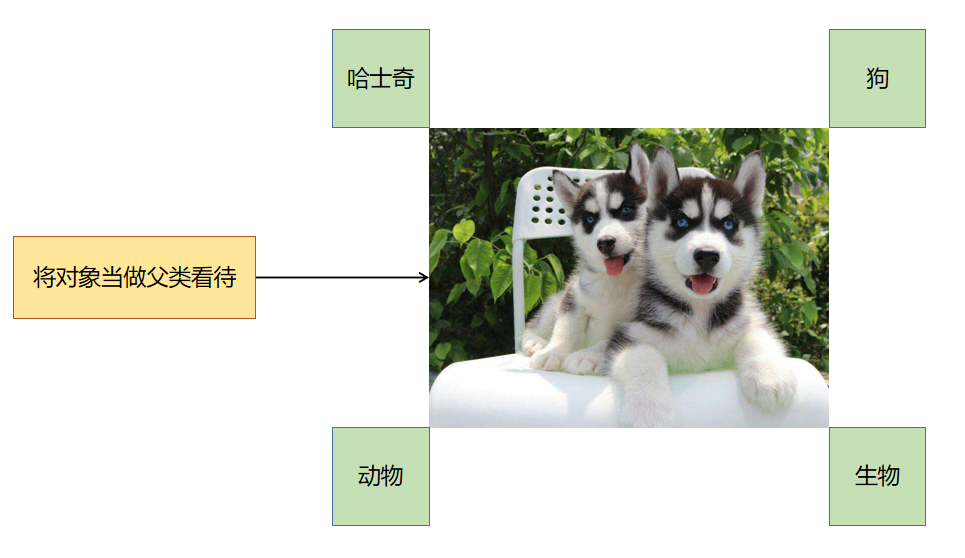

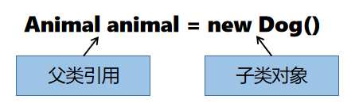

通过父类引用指向子类对象，从而产生多种形态。父类引用仅能访问父类所声明的属性和方法，不能访问子类独有的属性和方法。

在一对有继承关系的类中都有一个函数，其函数名、参数列表、返回值均相同，通过调用函数实现不同类对象完成不同的事件。

构成多态需要满足三个条件：

1. 必须存在继承关系。
2. 继承关系中必须有同名的虚函数。
3. 存在基类类型的指针或引用，通过该指针或引用调用虚函数。

<div style="page-break-after: always;"></div>

## 4.2 虚函数

**虚函数**

虚函数是定义在基类中的函数，子类必须对其进行重写/覆盖（override），虚函数需要在类的成员函数前面加上`virtual`关键字。

重写/覆盖是指子类中存在重新定义的函数，其函数名、参数列表、返回值类型都与父类中被重写的函数一致。被重写的函数必须是虚函数。

子类若重写了父类的函数，那么子类将会隐藏其父类中被重写的函数。但是子类通过强制类型转换成父类后可以重新调用父类中被重写的函数。

---

【代码】虚函数

- programmer.h

```c++
#ifndef _PROGRAMMER_H_
#define _PROGRAMMER_H_

#include <string>

class Programmer {
public:
    Programmer(std::string title = "programmer");
    virtual void work();
    
private:
    std::string title;
};

#endif
```

- programmer.cpp

```c++
#include "programmer.h"
#include <iostream>

using namespace std;

Programmer::Programmer(string title) : title(title) {}

void Programmer::work() {
    cout << "programming" << endl;
}
```

- java_programmer.h

```c++
#ifndef _JAVA_PROGRAMMER_H_
#define _JAVA_PROGRAMMER_H_

#include "programmer.h"
#include <string>

class JavaProgrammer : public Programmer {
public:
    JavaProgrammer(std::string title = "Java Programmer");
    virtual void work() override;
};

#endif
```

- java_programmer.cpp

```c++
#include "java_programmer.h"
#include <iostream>

using namespace std;

JavaProgrammer::JavaProgrammer(string title) 
    : Programmer(title) {}

void JavaProgrammer::work() {
    cout << "Android Development" << endl;
}
```

- test_programmer.cpp

```c++
#include <iostream>
#include "programmer.h"
#include "java_programmer.h"

using namespace std;

int main() {
    JavaProgrammer javaProgrammer;
    javaProgrammer.work();
    Programmer programmer = (Programmer)javaProgrammer;
    programmer.work();
    return 0;
}
```

> 运行结果

```
Android Development
programming
```

<div style="page-break-after: always;"></div>

## 4.3 纯虚函数

**纯虚函数**

在虚函数后加上`= 0`后可以让这个函数变成纯虚函数，包含纯虚函数的类叫做抽象类（abstract class）或接口类（interface）。

抽象类不能被用于实例化对象，只是提供了所有的子类共有的部分。例如在动物园中，存在的都是“动物”具体的子类对象，并不存在“动物”对象，所以动物类不应该被独立创建成对象。

抽象类的作用是可以被子类继承，提供共性的属性和方法。父类提供的方法很难满足子类不同的需求，如果不定义该方法，则表示所有的子类都不具有该行为。如果定义该方法，所有的子类都在重写，那么这个方法在父类中是没有必要实现的，显得多余。

被`virtual`关键字修饰的方法称为纯虚函数。纯虚函数只有声明，没有实现。纯虚函数只能包含在抽象类中。产生继承关系后，子类必须重写父类中所有的纯虚函数，否则子类还是抽象类。

---

【代码】纯虚函数

- shape.h

```c++
#ifndef _SHAPE_H_
#define _SHAPE_H_

class Shape {
public:
    virtual double getArea() = 0;
};

#endif
```

- rectangle.h

```c++
#ifndef _RECTANGLE_H_
#define _RECTANGLE_H_

#include "shape.h"

class Rectangle : public Shape {
public:
    Rectangle(double length = 0, double width = 0);
    virtual double getArea() override;

private:
    double length;
    double width;
};

#endif
```

- rectangle.cpp

```c++
#include "rectangle.h"

Rectangle::Rectangle(double length, double width)
    : length(length), width(width) {}

double Rectangle::getArea() {
    return length * width;
}
```

- circle.h

```c++
#ifndef _CIRCLE_H_
#define _CIRCLE_H_

#include "shape.h"

class Circle : public Shape {
public:
    Circle(double raidus = 0);
    virtual double getArea() override;

private:
    double radius;
};

#endif
```

- circle.cpp

```c++
#include "circle.h"

Circle::Circle(double radius) : radius(radius) {}

double Circle::getArea() {
    return 3.14159 * radius * radius;
}
```

- test_shape.cpp

```c++
#include <iostream>
#include "rectangle.h"
#include "circle.h"

using namespace std;

int main() {
    Rectangle rectangle(7, 5);
    Circle circle(6);
    cout << "rectangle: " << rectangle.getArea() << endl;
    cout << "circle: " << circle.getArea() << endl;
    return 0;
}
```

> 运行结果

```
rectangle: 35
circle: 113.097
```


**接口（Interface）**

在面向对象中会使用抽象类为外部提供一个通用的、标准化的接口。

宏观上来讲，接口是一种标准。例如常见的USB接口，电脑通过USB接口连接各种外设设备，每一个接口不用关心连接的外设设备是什么，只要这个外设设备实现了USB的标准，就可以连接到电脑上。


从程序上来讲，接口代表了某种能力和约定。当父类的方法无法满足子类需求时，可实现接口扩充子类的能力，接口中方法的定义代表能力的具体要求。

使用接口可以进行对行为的约束和规则的制定，接口表示一组能力，那么一个类可以接受多种能力的约束。因此一个类可以实现多个接口，实现多个接口的时候，必须要把每一个接口中的方法都实现。

---

【代码】接口

- language.h

```c++
#ifndef _LANGUAGE_H_
#define _LANGUAGE_H_

class Language {
public:
    virtual void translate() = 0;
};

#endif
```

- english.h

```c++
#ifndef _ENGLISH_H_
#define _ENGLISH_H_

#include "language.h"
#include <string>

class English : public Language {
public:
    English(std::string content = "");
    virtual void translate() override;

private:
    std::string content;
};

#endif
```

- english.cpp

```c++
#include "english.h"
#include <iostream>
#include <string>

using namespace std;

English::English(string content) : content(content) {}

void English::translate() {
    cout << content << endl;
}
```

- chinese.h

```c++
#ifndef _CHINESE_H_
#define _CHINESE_H_

#include "language.h"
#include <string>

class Chinese : public Language {
public:
    Chinese(std::string content = "");
    virtual void translate() override;

private:
    std::string content;
};

#endif
```

- chinese.cpp

```c++
#include "chinese.h"
#include <iostream>
#include <string>

using namespace std;

Chinese::Chinese(string content) : content(content) {}

void Chinese::translate() {
    cout << content << endl;
}
```

- test_language.cpp

```c++
#include <iostream>
#include "language.h"
#include "english.h"
#include "chinese.h"

using namespace std;

void show(Language& language) {
    language.translate();
}

int main() {
    English english("Hello!");
    show(english);

    Chinese chinese("你好！");
    show(chinese);
    return 0;
}
```

> 运行结果

```
Hello!
你好
```

<div style="page-break-after: always;"></div>

# 第5章 异常

## 5.1 异常的概念

**异常（Exception）**

异常就是程序在运行过程中出现的非正常的情况。异常本身是一个类，产生异常就是创建异常对象并抛出一个异常对象。C++处理异常的方法是中断处理。如果程序遇到了未经处理的异常，会导致这个程序无法进行编译或者运行。

C++异常处理涉及到三个关键字：

1. `throw`：当问题出现时，程序会抛出一个异常。
2. `try`：放置可能抛出异常的代码。
3. `catch`：捕获并处理异常。

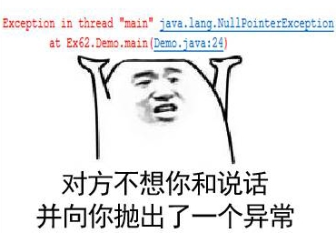

【代码】除以0

```c++
#include <iostream>

using namespace std;

int divide(int num1, int num2) {
    if(num2 == 0) {
        throw "division by zero";
    }
    return num1 / num2;
}

int main() {
    try {
        int result = divide(5, 0);
        cout << result << endl;
    } catch(const char *msg) {
        cerr << msg << endl;
    }

    return 0;
}
```

> 运行结果

```
division by zero
```

---

普通的异常会导致程序无法完成编译，这样的异常被称为非运行时异常（non-runtime exception），但是由于异常是发生在编译时期的，因此常常称为编译时异常。在运行中如果遇到了异常，会导致程序执行的强制停止，这样的异常被称为运行时异常。

<div style="page-break-after: always;"></div>

## 5.2 异常类

**异常类**

C++提供了一系列标准的异常，定义在`<exception>`中。


| 异常                  | 描述                  |
| :-------------------- | :-------------------- |
| std::exception        | 所有标准C++异常的父类 |
| std::bad_alloc        | 通过new抛出           |
| std::bad_cast         | 通过dynamic_cast抛出  |
| std::bad_exception    | 处理无法预期的异常    |
| std::bad_typeid       | 通过typeid抛出        |
| std::logic_error      | 逻辑错误              |
| std::domain_error     | 使用了无效的定义域    |
| std::invalid_argument | 使用了无效的参数      |
| std::length_error     | 创建过长的std::string |
| std::out_of_range     | 访问定义外的元素      |
| std::runtime_error    | 运行时错误            |
| std::overflow_error   | 发生上溢              |
| std::underflow_error  | 发生下溢              |
| std::range_error      | 存储超出范围的值      |

`what()`是异常类提供的一个公共方法，它已被所有子异常类重载。

---

【代码】bad_alloc

```c++
#include <iostream>
#include <exception>

using namespace std;

int main() {
    try {
        char *p = new char[0xfffffffff];
        delete p;
    } catch(bad_alloc &e) {
        cerr << e.what() << endl;
    }
    return 0;
}
```

> 运行结果

```
std::bad_alloc
```

<div style="page-break-after: always;"></div>

## 5.3 自定义异常

**自定义异常**

系统中提供了很多的异常类型，但是异常类型提供地再多，也无法满足所有的需求。当需要的异常类型系统没有提供的时候，此时就需要自定义异常了。通过继承和重载`exception`类可以定义新的异常。

---

【代码】自定义异常

```c++
#include <iostream>
#include <string>
#include <exception>
using namespace std;

class AgeException : public exception {
public:
    AgeException(string msg) : msg(msg) {}
    virtual const char* what() const noexcept override {
        return msg.c_str();
    }
private:
    string msg;
};

int main() {
    try {
        int age;
        cout << "Enter age: ";
        cin >> age;
        if(age < 0 || age > 130) {
            throw AgeException("invalid age");
        }
    } catch(AgeException& e) {
        cout << e.what() << endl;
    }
    return 0;
}
```

> 运行结果

```
Enter age: -1
invalid age
```

<div style="page-break-after: always;"></div>

# 第6章 I/O库

## 6.1 标准I/O

**标准I/O**

C++不直接处理输入输出，而是通过标准库中的一组类来处理I/O。输入流`istream`提供输入，输出流`ostream`提供输出。

标准输入输出有以下特点：

1. `cin`是`istream`的对象，从标准输入读取数据。
2. `cout`是`ostream`的对象，向标准输出写数据。
3. `cerr`是`ostream`的对象，用于输出错误信息，写到标准错误。
4. `>>`运算符从`istream`对象读取输入。
5. `<<`运算符从`ostream`对象写输出。
6. `getline()`从给定的`istream`读取一行数据，存入`string`对象。


**I/O格式化**

每个`iostream`对象维护一个格式状态来控制I/O的细节，如进制、精度、宽度等。操纵符改变流的格式状态时，通常改变后的状态对所有后续I/O都生效。

标准库定义了一组操纵符用来修改流的格式状态：

| 操纵符          | 功能                                        |
| --------------- | ------------------------------------------- |
| boolalpha       | 将true和false输出为字符串                   |
| noboolalpha     | 将true和false输出为1和0                     |
| showbase        | 对整型值输出表示进制的前缀                  |
| noshowbase      | 不生成表示进制的前缀                        |
| showpoint       | 浮点数总是显示小数点                        |
| noshowpoint     | 只有浮点数包含小数部分才显示小数点          |
| showpos         | 非负数显示“+”                               |
| noshowpos       | 非负数不显示“+”                             |
| uppercase       | 在十六进制中打印“0X”，在科学计数法中打印“E” |
| nouppercase     | 在十六进制中打印“0x”，在科学计数法中打印“e” |
| dec             | 整型显示为十进制                            |
| hex             | 整型显示为十六进制                          |
| oct             | 整型显示为八进制                            |
| left            | 在值的左侧添加填充字符                      |
| right           | 在值的右侧添加填充字符                      |
| internal        | 在符号和值之间添加填充字符                  |
| fixed           | 浮点数显示为定点十进制                      |
| scientific      | 浮点数显示为科学计数法                      |
| unitbuf         | 每次输出操作后刷新缓冲区                    |
| nounitbuf       | 恢复正常的缓冲区刷新方式                    |
| skipws          | 输入运算符跳过空白符                        |
| noskipws        | 输入运算符不跳过空白符                      |
| flush           | 刷新`ostream`缓冲区                         |
| ends            | 插入空字符，然后刷新ostream缓冲区           |
| endl            | 插入换行符，然后刷新ostream缓冲区           |
| setfill(ch)     | 用ch填充空白                                |
| setprecision(n) | 将浮点精度设置为n                           |
| setw(n)         | 读或写值的宽度为n个字符                     |
| setbase(n)      | 将整数输出为n进制                           |

【代码】格式化输出

```c++
#include <iostream>
#include <cmath>
#include <iomanip>

using namespace std;

int main() {
    cout << "布尔：";
    cout << boolalpha << true << " " << false << endl;
    cout << "------------------------------" << endl;
    
    cout << "十进制：";
    cout << dec << 20 << " " << 1024 << endl;
    
    cout << "十六进制：";
    cout << showbase << hex 
         << 20 << " "<< 1024
         << noshowbase << endl;
    
    cout << "八进制：";
    cout << oct << 20 << " " << 1024 << dec << endl;
    cout << "------------------------------" << endl;
    
    cout << "科学计数法：";
    cout << scientific
         << 100 * sqrt(2)
         << defaultfloat << endl;
    cout << "------------------------------" << endl;
    
    cout << "默认输出浮点数：";
    cout << 10.0 << endl;
    
    cout << "浮点数打印小数点：";
    cout << showpoint << 10.0 << noshowpoint << endl;
    cout << "------------------------------" << endl;
    
    cout << "精度：";
    cout << setprecision(3) << fixed << sqrt(2) << endl;
    cout << "------------------------------" << endl;
    
    cout << "宽度填充：";
    cout << setfill('0') << setw(4) << 2021 << "/"
         << setw(2) << 9 << "/"
         << setw(2) << 2 << endl;
    return 0;
}
```

> 运行结果

```
布尔：true false
------------------------------
十进制：20 1024
十六进制：0x14 0x400
八进制：24 2000
------------------------------
科学计数法：1.414214e+02
------------------------------
默认输出浮点数：10
浮点数打印小数点：10.0000
------------------------------
精度：1.414
------------------------------
宽度填充：2021/09/02
```

<div style="page-break-after: always;"></div>

## 6.2 文件I/O

**文件I/O**

程序不仅要从控制台进行I/O，还需要读写文件和字符串。

标准库的I/O类型在3个头文件中：

1. `<iostream>`定义了读写流的基本类型。
2. `<fstream>`定义了读写文件的类型。
3. `<sstream>`定义了读写`string`对象的类型。

`<fstream>`中定义了3个I/O类来读写文件：

1. `ifstream`从给定文件读数据。
2. `ofstream`向给定文件写数据。
3. `fstream`可读写文件。


**文件打开模式**

每个流都有一个关联的文件模式，在打开文件时可以指定文件模式。

| 打开模式   | 作用                                            |
| ---------- | ----------------------------------------------- |
| ios::in    | 以读方式打开                                    |
| ios::out   | 以写方式打开                                    |
| ios::app   | 以追加方式打开                                  |
| ios::ate   | 打开文件定位到文件末尾                          |
| ios::trunc | 如果文件存在，其内容将被截断，即把文件长度设为0 |

【代码】文件I/O

```c++
#include <iostream>
#include <fstream>

using namespace std;

int main() {
    string name;
    int id;
    cout << "Enter name: ";
    cin >> name;
    cout << "Enter id: ";
    cin >> id;
    
    ofstream out("info.txt");
    out << name << " " << id << endl;
    out.close();
    
    ifstream in("info.txt");
    in >> name >> id;
    in.close();
    
    cout << "name = " << name << ", id = " << id << endl;
    return 0;
}
```

> 运行结果

```
Enter name: Terry
Enter id: 979489
name = Terry, id = 979489
```

<div style="page-break-after: always;"></div>

## 6.3 string流

**string流**

`<sstream>`定义了3个类来支持内存IO：

1. `istringstream`从`string`读数据。
2. `ostringstream`向`string`写数据。
3. `stringstream`可读写`string`。

---

【代码】string流

```c++
#include <iostream>
#include <sstream>
#include <string>

using namespace std;

int main() {
    string line;
    cout << "convert a string to Python list format: ";
    getline(cin, line);

    ostringstream out;
    istringstream in(line);
    string token;

    out << "[";
    while(in >> token) {
        out << token << ", ";
    }
    out << "\b\b]";
cout << out.str() << endl;
    return 0;
}
```

> 运行结果

```
convert a string to Python list format: This is a test
[This, is, a, test]
```

<div style="page-break-after: always;"></div>

# 第7章 STL标准模板库

## 7.1 模板

**泛型编程（Generic Programming）**

面向对象编程（OOP）和泛型编程（GP）都能处理在编写程序时类型未知的情况，OOP能处理运行时获取类型的情况，GP能处理编译期可获取类型的情况。

模板是泛型编程的基础，泛型编程就是以一种独立于任何特定类型的方式编写代码。C++标准库的容器、迭代器、算法都是泛型编程的例子。


**函数模板**

通过定义一个通用的函数模板可以处理参数为多种类型的情形，而不是为每个类型都定义一个重载。模板定义使用`template`关键字，后跟模板参数列表。模板参数表示函数或类定义中用到的类型，使用模板时需要隐式或显式提供模板实参，将其绑定到模板参数。

---

【代码】函数模板

```c++
#include <iostream>
#include <string>

using namespace std;

template <typename T>
inline T getMax(const T& val1, const T& val2) {
    return val1 > val2 ? val1 : val2;
}

int main() {
    int iVal1 = 28;
    int iVal2 = 92;
    cout << getMax(iVal1, iVal2) << endl;

    double dVal1 = 3.14;
    double dVal2 = 3.71;
    cout << getMax(dVal1, dVal2) << endl;

    string sVal1 = "hello";
    string sVal2 = "world";
    cout << getMax(sVal1, sVal2) << endl;
    return 0;
}
```

> 运行结果

```
92
3.71
world
```

---

函数模板仅仅是函数的规范，本身并不会占用内存。当编译器遇到对模板函数的调用时，才会在内存中创建该函数的实例。


**类模板**

类模板用来生成类的蓝图，与函数模板不同的是，类模板在实例化时编译器无法为类模板推导模板参数类型，而是必须在模板名后用`<>`提供实参。根据显式提供的模板实参列表，编译器使用这些模板参数来实例化特定的类。

编译器从类模板实例化一个类时，会重写模板，将模板参数的每个实例替换为给定的模板实参。因此类模板的每个实例都是独立的类，使用不同模板实参实例化出的类之间没有关联，也没有特殊的访问权限。

---

【代码】类模板

```c++
#include <iostream>
#include <sstream>
#include <algorithm>

using namespace std;

template<class T>
class SortedArray {
public:
    SortedArray(int capacity = 1);
    SortedArray(T *arr, int capacity);
    ~SortedArray();

    string data();
    void add(T val);
    void remove(T val);

private:
    T *arr;
    int len;
    int capacity;
    void resize(int size);
};

template<class T>
SortedArray<T>::SortedArray(int capacity) {
    this->len = 0;
    this->capacity = capacity;
    this->arr = new T[capacity];
}

template<class T>
SortedArray<T>::SortedArray(T *arr, int len) {
    this->len = len;
    this->capacity = len;
    this->arr = new T[len];
    for(int i = 0; i < len; i++) {
        this->arr[i] = arr[i];
    }
}

template<class T>
SortedArray<T>::~SortedArray() {
    delete arr;
}

template<class T>
string SortedArray<T>::data() {
    if(len == 0) {
        return "[]";
    }

    sort(this->arr, this->arr + len);
    ostringstream out;
    out << "[";
    for(int i = 0; i < len; i++) {
        out << arr[i] << ", ";
    }
    out << "\b\b]";
    return out.str();
}

template<class T>
void SortedArray<T>::resize(int size) {
    T *temp = new T[size];
    for(int i = 0; i < len; i++) {
        temp[i] = arr[i];
    }
    delete arr;
    arr = temp;
}

template<class T>
void SortedArray<T>::add(T val) {
    if(len == capacity) {
        capacity *= 2;
        resize(capacity);
    }
    arr[len++] = val;
}

template<class T>
void SortedArray<T>::remove(T val) {
    for(int i = 0; i < len; i++) {
        if(arr[i] == val) {
            arr[i] = arr[len-1];
            len--;
            if(len <= capacity / 2) {
                capacity /= 2;
                resize(capacity);
            }
            break;
        }
    }
}

int main() {
    int arr[] = {7, 7, 3, 9, 7, 1, 3};
    int n = sizeof(arr) / sizeof(arr[0]);

    SortedArray<int> sortedArray(arr, n);
    cout << sortedArray.data() << endl;

    sortedArray.add(28);
    sortedArray.add(12);
    cout << sortedArray.data() << endl;

    sortedArray.remove(7);
    sortedArray.remove(9);
    cout << sortedArray.data() << endl;

    return 0;
}
```

> 运行结果

```
[1, 3, 3, 7, 7, 7, 9] 
[1, 3, 3, 7, 7, 7, 9, 12, 28]
[1, 3, 3, 7, 7, 12, 28]
```

<div style="page-break-after: always;"></div>

## 7.2 容器

**容器（Container）**

容器是特定类型对象的集合，容器分为顺序容器和关联容器：

1. 顺序容器：元素的顺序与其加入容器的位置对应。
2. 关联容器：元素的顺序由其关联的关键字决定，关联容器分为有序关联容器和无序关联容器。

所有容器类共享公有接口，不同容器按不同方式扩展。

C++新标准容器的性能比旧版本快很多，其性能与最精心优化过的同类数据结构一样好。现代C++程序应该使用标准库容器，而不是更原始的数据结构。


**顺序容器**

每个容器都定义于一个头文件中，文件名与容器名相同。容器都定义为模板类，顺序容器几乎可以保存任意类型的元素，还可以在容器中保存容器。

顺序容器包括`array`、`vector`、`string`、`deque`、`list`和`forward_list`。

| 容器         | 描述                                                         |
| ------------ | ------------------------------------------------------------ |
| array        | 固定大小数组，支持快速随机访问，不能添加或删除元素           |
| vector       | 可变大小数组，支持快速随机访问，在尾部之外的位置插入或删除元素可能很慢 |
| string       | 与`vector`相似的容器，但专门用于保存字符，随机访问快，在尾部插入或删除速度快 |
| deque        | 双端队列，支持快速随机访问，在头尾位置插入或删除速度很快     |
| list         | 双向链表，支持双向顺序访问，在任何位置插入或删除都很快       |
| forward_list | 单项链表，只支持单向顺序访问，在任何位置插入或删除都很快     |

`array`和内置数组一样大小固定，但操作更安全。除固定大小的`array`外，其它容器都提供高效灵活的内存管理，可以添加、删除、扩展和收缩容器的大小。

`vector`和`string`将元素存储在连续空间中，故通过下标的随机访问很快。在尾部添加元素很快，但中间和头部插入或删除很慢。添加元素可能造成空间的重新分配和元素拷贝。

`deque`支持快速随机访问，在两端插入或删除很快，但在中间插入或删除元素很慢。

`list`和`forward_list`的设计目的是让任何位置的插入或删除都快速高效且不需重新分配内存，但是不支持随机访问，为访问一个元素需要遍历整个链表。


**迭代器（Iterator）**

迭代器比下标访问更通用，所有标准库容器都支持迭代器，但只有几种支持下标。迭代器提供了对容器对象的间接访问，类似于指针。`begin()`方法返回指向首元素的迭代器，`end()`方法返回指向尾元素下一位置（尾后）的迭代器。如果容器为空，则`begin()`和`end()`返回的都是尾后迭代器。

任何可能改变容器容量的操作都会使容器的迭代器失效。

| 迭代器                 | 描述                           |
| ---------------------- | ------------------------------ |
| iterator               | 容器的迭代器                   |
| begin()                | 返回指向首元素的迭代器         |
| end()                  | 返回尾后迭代器                 |
| const_iterator         | 只读迭代器                     |
| cbegin()               | 返回指向首元素的只读迭代器     |
| cend()                 | 返回尾后只读迭代器             |
| reverse_iterator       | 按逆序寻址元素的迭代器         |
| const_reverse_iterator | 只读逆序迭代器                 |
| rbegin()               | 返回指向尾元素的逆序迭代器     |
| rend()                 | 返回首前逆序迭代器             |
| crbegin()              | 返回指向尾元素的只读逆序迭代器 |
| crend()                | 返回首前只读逆序迭代器         |

迭代器可以进行算术运算，将迭代器与整数相加减可以得到向前或向后若干位置的迭代器。使用关系运算符`<`、`<=`、`>`、`>=`和`==`可以对迭代器所指位置比较大小。将两个迭代器相减，结果是两个迭代器的距离。

---

【代码】迭代器

```c++
#include <iostream>
#include <string>

using namespace std;

int main() {
    string s = "hello world";

    string::iterator iter = s.begin();
    cout << "[";
    while(iter != s.end()) {
        cout << *iter << ", ";
        iter++;
    }
    cout << "\b\b]" << endl;

    return 0;
}
```

> 运行结果

```
[h, e, l, l, o,  , w, o, r, l, d]
```

<div style="page-break-after: always;"></div>

## 7.3 STL数组

**array**

`array`容器是C++11标准中新增的序列容器，它在普通数组的基础上，添加了一些成员函数和全局函数。在使用上，它比普通数组更安全，且效率并没有因此变差。和其它容器不同，`array`的大小是固定的，无法动态的扩展或收缩。与内置数组不同的是，`array`允许做整个容器的拷贝和赋值，要求两个`array`大小和元素类型都一样。

`array`以类模板的形式定义在`<array>`头文件，`array`具有固定大小，其大小也是类型的一部分，定义时模板参数包含元素类型和大小。

| 成员函数        | 功能                                                         |
| --------------- | ------------------------------------------------------------ |
| size()          | 返回容器中当前元素的数量，其值始终等于初始化array类的第二个模板参数N |
| max_size()      | 返回容器可容纳元素的最大数量，其值始终等于初始化array类的第二个模板参数N |
| empty()         | 判断容器是否为空                                             |
| at(n)           | 返回容器中第n个元素的引用，该函数自动检查n是否在有效的范围内，如果不是则抛出`out_of_range`异常 |
| front()         | 返回容器中第一个元素的直接引用，不适用于空array容器          |
| back()          | 返回容器中最后一个元素的直接应用，不适用于空array容器        |
| data()          | 返回一个指向容器首个元素的指针                               |
| fill(val)       | 将val赋值给容器中的每个元素                                  |
| arr1.swap(arr2) | 交换arr1和arr2容器中的所有元素，前提是它们具有相同的长度和类型 |

【代码】array

```c++
#include <iostream>
#include <array>

using namespace std;

int main() {
    array<int, 10> arr = {0, 1, 2, 3, 4, 5, 6, 7, 8, 9};
    cout << "size = " << arr.size() << endl;
    array<int, 10>::iterator begin = arr.begin();
    array<int, 10>::iterator end = arr.end();
    while(begin != end) {
        cout << *begin << " ";
        begin++;
    }
    cout << endl;
    return 0;
}
```

> 运行结果

```
size = 10
0 1 2 3 4 5 6 7 8 9
```


**vector**

`vector`表示对象的集合，由于`vector`容纳其它的对象，所以是一种容器。使用`vector`需要包含头文件`<vector>`。`vector`是一个类模板，模板可以看作编译器生成类或函数的一份说明。

`vector`的初始化包括直接初始化、拷贝初始化和列表初始化。

| 初始化                       | 描述                                           |
| ---------------------------- | ---------------------------------------------- |
| vector<T> v                  | 创建一个空的vector                             |
| vector<T> v2(v1)             | 用v1中所有元素的副本创建v2                     |
| vector<T> v2 = v1            | 等价于v2(v1)                                   |
| vector<T> v(n, val)          | v中包含了n个值为val的元素                      |
| vector<T> v(n)               | v中包含了n个值为默认初始化的元素               |
| vector<T> v{a, b, c, ...}    | 用列表元素初始化v                              |
| vector<T> v = {a, b, c, ...} | 等价于v{a, b, c, ...}                          |
| vector<T> v (begin, end)     | 根据迭代器范围[begin, end)复制到另一个vector中 |

【代码】vector构造函数

```c++
#include <iostream>
#include <string>
#include <vector>
#include <algorithm>
#include <iterator>

using namespace std;

template <typename T>
ostream& operator<<(ostream& out, const vector<T>& v) {
    if(!v.empty()) {
        out << "[";
        copy(v.begin(), v.end(), ostream_iterator<T>(out, ", "));
        out << "\b\b]";
    }
    return out;
}

int main() {
    vector<int> v1(10);         // 有10个元素，都是0
    vector<int> v2{10};         // 有1个元素，值是10
    vector<int> v3(10, 1);      // 有10个元素，都是1
    vector<int> v4{10, 1};      // 有2个元素，10和1
    vector<string> v5{"hello"}; // 有1个元素，是字符串"hello"
    
    cout << "v1 = " << v1 << endl;
    cout << "v2 = " << v2 << endl;
    cout << "v3 = " << v3 << endl;
    cout << "v4 = " << v4 << endl;
    cout << "v5 = " << v5 << endl;
    return 0;
}
```

> 运行结果

```
v1 = [0, 0, 0, 0, 0, 0, 0, 0, 0, 0] 
v2 = [10] 
v3 = [1, 1, 1, 1, 1, 1, 1, 1, 1, 1] 
v4 = [10, 1]
v5 = [hello]
```


**vector操作**

| vector操作          | 描述                                                         |
| ------------------- | ------------------------------------------------------------ |
| v.empty()           | 判断vector是否为空                                           |
| v.size()            | 返回vector元素个数                                           |
| v[n]                | 返回vector中第n个元素的引用                                  |
| v1 = v2             | 用v2中的元素拷贝替换v1中的元素                               |
| v1 == v2、v1 != v2  | v1和v2相等当且仅当它们的元素个数相同，并且对应位置元素都相同 |
| v.push_back(val)    | 向vector尾部添加一个元素                                     |
| v.insert(iter, val) | 向迭代器指向元素前添加一个元素                               |
| v.pop_back()        | 删除vector最后一个元素                                       |
| v.erase(iter)       | 删除迭代器指向元素                                           |
| v.erase(begin, end) | 删除迭代器返回[begin, end)范围元素                           |
| v.clear()           | 清空vector                                                   |
| v.swap(vector &)    | 交换两个同类型vector数据                                     |
| v.assign(n, val)    | 设置vector中前n个元素值为val                                 |

`vector`不能使用下标添加元素，否则会造成缓冲区溢出，确保下标合法的一种有效手段就是尽可能使用`for-each`循环。如果循环体内部包含向`vector`添加元素的语句，则不能使用`for-each`循环。

---

【代码】vector

```c++
#include <iostream>
#include <vector>

using namespace std;

int main() {
    vector<int> v;
    for(int i = 0; i < 10; i++) {
        v.push_back(i * i);
}

    for(int& item : v) {
        cout << item << " ";
    }
    cout << endl;
    return 0;
}
```

> 运行结果

```
0 1 4 9 16 25 36 49 64 81
```

<div style="page-break-after: always;"></div>

## 7.4 STL字符串

**string**

`string`是标准库中的类型，表示可变长字符序列，使用需要包含头文件`<string>`。

`string`的初始化分为：

1. 直接初始化：使用括号初始化，调用构造函数。
2. 拷贝初始化：使用赋值初始化，调用重载的赋值运算符。

---

【代码】string初始化

```c++
#include <iostream>
#include <string>

using namespace std;

int main() {
    string s1;              // 默认初始化，为空字符串
    string s2(s1);          // 直接初始化，s2是s1的副本
    string s3 = s1;         // 拷贝初始化，s3是s1的副本，等价s3(s1)
    string s4("hello");     // 直接初始化，初始化为字面值常量
    string s5 = "hello";    // 拷贝初始化，初始化为字面值常量，等价于s5("hello")
    string s6(10, 'x');     // 直接初始化，初始化为10个字符'x'
    
    cout << "s1 = " << s1 << endl;
    cout << "s2 = " << s2 << endl;
    cout << "s3 = " << s3 << endl;
    cout << "s4 = " << s4 << endl;
    cout << "s5 = " << s4 << endl;
    cout << "s6 = " << s4 << endl;
    
    return 0;
}
```

> 运行结果

```
s1 = 
s2 =
s3 =
s4 = hello
s5 = hello
s6 = hello
```


**string操作**

| string操作             | 描述                                                         |
| ---------------------- | ------------------------------------------------------------ |
| out << s               | 将s写到输出流out中                                           |
| in >> s                | 从输入流in中读取字符串赋给s，字符串以空白符分割              |
| getline(in, s)         | 从输入流in中读取一行赋给s                                    |
| s.empty()              | 判断s是否为空                                                |
| s.size()               | 返回s中字符个数                                              |
| s[n]                   | 返回s中第n个字符的引用                                       |
| s1 + s2                | 返回s1和s2连接后的结果                                       |
| s1 = s2                | 用s2的副本替换s1                                             |
| s1 == s2、s1 != s2     | 判断s1和s2是否相等                                           |
| <、<=、>、>=           | 字典序比较，对大小写敏感                                     |
| s1.append(s2)          | 尾部插入                                                     |
| s1.insert(pos, s2)     | 在第pos个位置插入s2                                          |
| s.erase(pos, n)        | 从第pos个位置删除n个字符                                     |
| s1.replace(pos, n, s2) | 从第pos个位置开始替换n个字符为s2                             |
| s.substr(pos, n)       | 返回一个string，包含s中从pos开始的n个字符的拷贝。pos的默认值为0，n的默认值为s.size() - pos。 |
| s1.find(s2)            | 查找s1中s2第一次出现的位置                                   |
| s1.rfind(s2)           | 查找s1中s2最后一次出现的位置                                 |

【代码】string

```c++
#include <iostream>
#include <string>

using namespace std;

int main() {
    string s("Hello");

    s.append("world");          // Helloworld
    s.insert(s.size(), "!");    // Helloworld!

    s.replace(1, 4, "i");       // Hiworld!
    s.erase(2, 5);              // Hi!
    s.insert(2, " C++");        // Hi C++!

    cout << s << endl;

    cout << s.substr(3, 3) << endl;
    cout << s.substr(3) << endl;
    cout << s.find("C++") << endl;

    return 0;
}
```

> 运行结果

```
Hi C++!
C++
C++!
3
```

<div style="page-break-after: always;"></div>

## 7.5 STL链表

**list**

`list`双向链表是一种序列式容器，`list`中的元素通过指针连成逻辑意义上的线性表。由于`list`中元素结点并不要求在一段连续的内存中，因此`list`是不支持快速随机存取的，迭代器只能通过`++`或`--`移动到后继或前驱结点处，而不能使用`+n`或`-n`的操作。


| list操作                | 描述                                                         |
| ----------------------- | ------------------------------------------------------------ |
| list<T> lst             | 创建空的list                                                 |
| list<T> lst(n)          | 创建含有n个元素的list                                        |
| list<T> lst(n, val)     | 创建n个值为val的list                                         |
| list<T> lst1(lst2)      | 使用lst2初始化lst1                                           |
| list<T> lst(begin, end) | 根据迭代器返回初始化list                                     |
| lst.size()              | 返回list元素个数                                             |
| lst.clear()             | 删除所有元素                                                 |
| lst.empty()             | 判断list是否为空                                             |
| lst.front()             | 返回第一个元素                                               |
| lst.back()              | 返回最后一个元素                                             |
| lst.insert()            | 插入一个元素                                                 |
| lst.erase()             | 删除一个元素                                                 |
| lst.push_front()        | 在头部添加一个元素                                           |
| lst.push_back()         | 在尾部添加一个元素                                           |
| lst.pop_front()         | 删除第一个元素                                               |
| lst.pop_back()          | 删除最后一个元素                                             |
| lst.remove()            | 删除元素                                                     |
| lst.reverse()           | 反转list                                                     |
| lst.sort()              | 排序                                                         |
| lst.unique()            | 去除相邻的重复元素（只留一个），函数并不是把重复的元素删除，而是全部放到数组尾部，返回去重后的尾地址。`unique()`中不自带`sort()`，因此需要先使用`sort()`进行排序 |
| lst.swap()              | 交换两个list                                                 |
| lst.splice()            | 合并两个list                                                 |
| lst.merge()             | 合并两个有序list                                             |

【代码】list

```c++
#include <iostream>
#include <list>

using namespace std;

void printList(list<int> lst) {
    for(list<int>::iterator iter = lst.begin(); iter != lst.end(); iter++) {
        cout << *iter << " ";
    }
    cout << endl;
}

int main() {
    list<int> lst;

    lst.push_back(11);       // [11]
    lst.push_front(22);      // [22, 11]
    cout << lst.front() << endl;    // 22
    cout << lst.back() << endl;     // 11

    lst.insert(++lst.begin(), 3);   // [22, 3, 11]
    lst.insert(--lst.end(), 2);     // [22, 3, 2, 11]
    lst.push_back(2);               // [22, 3, 2, 11, 2]
    printList(lst);

    lst.pop_front();                // [3, 2, 11, 2]
    lst.sort();                     // [2, 2, 3, 11]
    lst.unique();                   // [2, 3, 11]
    printList(lst);

    list<int> lst2{0, 9, 2, 8};
    // [2, 3, 11, 0, 9, 2, 8]
    lst.splice(lst.end(), lst2, lst2.begin(), lst2.end());
    printList(lst);

    lst.sort();             // [0, 2, 2, 3, 8, 9, 11]
    printList(lst);

    list<int> lst3{1, 2, 8};
    lst.merge(lst3);        // [0, 1, 2, 2, 2, 3, 8, 8, 9, 11]
    printList(lst);

    return 0;
}
```

> 运行结果

```
22
11
22 3 2 11 2
2 3 11
2 3 11 0 9 2 8
0 2 2 3 8 9 11
0 1 2 2 2 3 8 8 9 11
```


**forward_list**

`forward_list`和`list`的区别在于前者是单向链表，每个元素内部只有一个链接指向下一个元素，因此在存储方面`list`会消耗更多的空间。


`forward_list`不支持反向迭代器，并且没有指向尾元素的迭代器，因此不提供`back()`、`push_back()`、`pop_back()`等操作。

<div style="page-break-after: always;"></div>

## 7.6 容器适配器

**stack**

栈，又名堆栈，是一种运算受限的线性数据结构，栈只能在表尾进行插入和删除操作。

栈中的元素只能先进后出（FILO, First In Last Out）。最早进入栈的元素所存放的位置叫作栈底（bottom），最后进入栈的元素存放的位置叫作栈顶（top）。

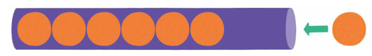

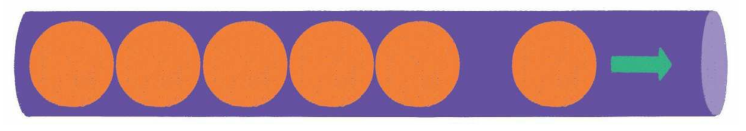

向一个栈插入新元素的操作称为入栈push（或进栈、压栈），从一个栈删除元素的操作称为出栈pop（或退栈、弹栈）。

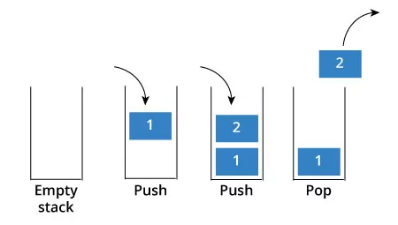

入栈操作就是把新元素放入栈中，只允许从栈顶一侧放入元素，新元素的位置将会成为新的栈顶。

最初，栈为空，栈顶的初始值为-1。每当向栈中添加元素时，栈顶指针加1。

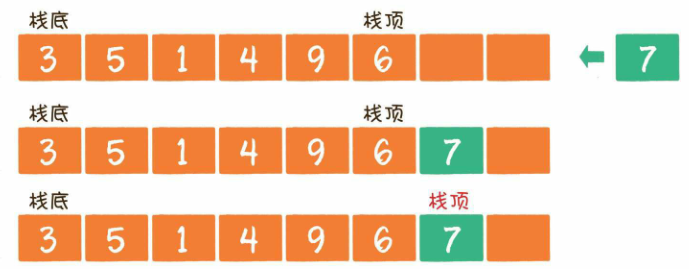

出栈操作就是把新元素从栈中弹出，只有栈顶元素才允许出栈，出栈元素的前一个元素将会成为新的栈顶。

从栈中移出元素，栈顶指针减1。数组中元素的删除并非真正意义上把元素从内存中清除，出栈只需对栈顶减1即可，后期向栈中添加元素时，新元素会将旧元素覆盖。

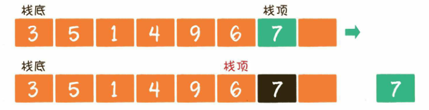

| stack操作 | 描述                                  |
| --------- | ------------------------------------- |
| empty()   | 判断栈是否为空                        |
| size()    | 返回栈中元素个数                      |
| push()    | 入栈，调用底层容器的`push_back()`实现 |
| pop()     | 出栈                                  |
| top()     | 返回栈顶元素的引用                    |

【代码】stack

```c++
#include <iostream>
#include <stack>

using namespace std;

int main() {
    stack<int> s;
    s.push(1);
    s.push(2);
    s.push(3);
    cout << s.top() << endl;

    while(!s.empty()) {
        cout << s.top() << endl;
        s.pop();
    }
    return 0;
}
```

> 运行结果

```
3
3
2
1
```


**deque**

双端队列是一种同时具有队列和栈的性质的数据结构，双端队列可以从其两端插入和删除元素。

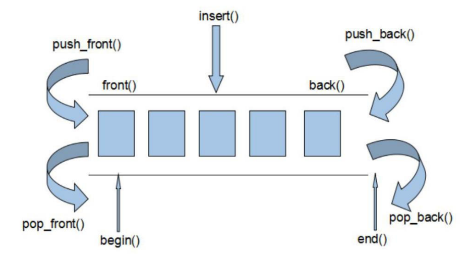

| deque操作    | 描述                |
| ------------ | ------------------- |
| empty()      | 判断deque是否为空   |
| size()       | 返回deque中元素个数 |
| front()      | 返回首元素引用      |
| back()       | 返回尾元素引用      |
| push_front() | 在头部添加一个元素  |
| push_back()  | 在尾部添加一个元素  |
| pop_front()  | 在头部删除一个元素  |
| pop_back()   | 在尾部删除一个元素  |
| clear()      | 清空deque           |

【代码】deque

```c++
#include <iostream>
#include <deque>

using namespace std;

int main() {
    deque<int> deq;
    
    deq.push_front(1);
    deq.push_front(2);
    deq.push_back(3);
    deq.push_back(4);
    cout << deq.front() << endl;
    cout << deq.back() << endl;

    deq.pop_back();
    deq.pop_front();
    cout << deq.front() << endl;
    cout << deq.back() << endl;

    return 0;
}
```

> 运行结果

```
2
4
1
3
```


**priority_queue**

普通的队列是一种先进先出（FIFO, First In First Out）的数据结构，元素在队尾添加，在队头删除。

在优先队列`priority_queue`中，元素被赋予优先级，当访问元素时，具有最高优先级的元素最先被访问。使用`priority_queue`需要包含头文件`<queue>`。

| priority_queue操作 | 描述               |
| ------------------ | ------------------ |
| empty()            | 判断队列是否为空   |
| size()             | 返回队列中元素个数 |
| top()              | 访问队头           |
| push()             | 插入元素           |
| pop()              | 弹出队头           |

【代码】priority_queue

```c++
#include <iostream>
#include <queue>

using namespace std;

int main() {
    priority_queue<int> pq;
    pq.push(9);
    pq.push(2);
    pq.push(8);

    while(!pq.empty()) {
        cout << pq.top() << endl;
        pq.pop();
    }
    return 0;
}
```

> 运行结果

```
9
8
2
```

<div style="page-break-after: always;"></div>

## 7.7 关联容器

**关联容器**

顺序容器的元素是按照在容器中的位置来保存和访问的，关联容器的元素按照关键字来保存和访问。关联容器支持高效地关键字查询和访问。所有关联容器都支持通用容器操作，但不支持顺序容器特有的操作，例如`push_front()`或`push_back()`。

`set`和`map`是两种关联容器，`set`中的元素只包含关键字，而`map`中的元素是键值对（key-value pair）。

| 关联容器           | 说明                              | 头文件            |
| ------------------ | --------------------------------- | ----------------- |
| set                | 只保存关键字的容器                | `<set>`           |
| multiset           | 关键字可以重复出现的set           | `<set>`           |
| unordered_set      | 用哈希函数组织的set               | `<unordered_set>` |
| unordered_multiset | 哈希组织的set，关键字可以重复出现 | `<unordered_set>` |
| map                | 保存键值对的容器                  | `<map>`           |
| multimap           | 关键字可重复出现的map             | `<map>`           |
| unordered_map      | 用哈希函数组织的map               | `<unordered_map>` |
| unordered_multimap | 哈希组织的map，关键字可以重复出现 | `<unordered_map>` |

`set`是关键字的集合，其底层实现使用的是红黑树，当想要查找一个值是否存在时可以使用。`set`是模板，使用时必须在模板参数中指定元素类型。

`map`是模板，使用时必须在模板参数中指定key和value的类型。`map`常称为关联数组或字典，但是其下标不必是整数，而是通过关键字来查找值。

`map`的元素都是pair类型，pair也是模板，定义在`<utility>`中，一个pair保存两个public的数据成员，分别叫first和second。

---

【代码】关键词提取

- summary.txt

```
Internet of Things allows billions of physical objects to be connected to collect and exchange data for offering various applications, such as environmental monitoring, infrastructure management, and home automation. On the other hand, IoT has unsupported features that are critical for some IoT applications, including smart traffic lights, home energy management and augmented reality. To support these features, fog computing is integrated into IoT to extend computing, storage and networking resources to the network edge. Unfortunately, it is confronted with various security and privacy risks, which raise serious concerns towards users. In this survey, we review the architecture and features of fog computing and study critical roles of fog nodes, including real-time services, transient storage, data dissemination and decentralized computation. We also examine fog-assisted IoT applications based on different roles of fog nodes.
```

- excludes.txt

```
the
a
an
is
this
that
of
at
in
on
for
and
it
with
to
we
I
into
which
these
those
are
be
as
has
have
or
```

- STL_set_map.cpp

```c++
#include <iostream>
#include <fstream>
#include <sstream>
#include <string>
#include <vector>
#include <set>
#include <map>
#include <cctype>
#include <algorithm>

using namespace std;

string getSummary(string filename) {
    ifstream in(filename);
    string summary;
    string line;
    while(getline(in, line)) {
        summary += line;
    }
    in.close();
    return summary;
}

set<string> getExcludes(string filename) {
    ifstream in(filename);
    set<string> excludes;
    string token;
    while(in >> token) {
        excludes.insert(token);
    }
    in.close();
    return excludes;
}

int main() {
    string summary = getSummary("summary.txt");
    vector<string> tokens;
    
    istringstream in(summary);
    string token;
    while(in >> token) {
        // eliminate the trailing punctuation
        if(!isalpha(token.back())) {
            token.pop_back();
        }
        
        // convert to lower case
        transform(
            token.begin(), token.end(), 
            token.begin(), ::tolower
        );

        tokens.push_back(token);
    }

    set<string> excludes = getExcludes("excludes.txt");
    map<string, int> keywords;

    for(string token : tokens) {
        // not in excludes set
        if(excludes.find(token) == excludes.end()) {
            keywords[token]++;
        }
    }
    
    for(auto& p : keywords) {
        cout << p.first << ": " << p.second << endl;
    }
    
    return 0;
}
```

> 运行结果

```
allows: 1
also: 1
applications: 3
architecture: 1
augmented: 1
automation: 1
based: 1
billions: 1
collect: 1
computation: 1
computing: 3
concerns: 1
confronted: 1
connected: 1
critical: 2
data: 2
decentralized: 1
different: 1
dissemination: 1
edge: 1
energy: 1
environmental: 1
examine: 1
exchange: 1
extend: 1
features: 3
fog: 4
fog-assisted: 1
hand: 1
home: 2
including: 2
infrastructure: 1
integrated: 1
internet: 1
iot: 4
lights: 1
management: 2
monitoring: 1
network: 1
networking: 1
nodes: 2
objects: 1
offering: 1
other: 1
physical: 1
privacy: 1
raise: 1
real-time: 1
reality: 1
resources: 1
review: 1
risks: 1
roles: 2
security: 1
serious: 1
services: 1
smart: 1
some: 1
storage: 2
study: 1
such: 1
support: 1
survey: 1
things: 1
towards: 1
traffic: 1
transient: 1
unfortunately: 1
unsupported: 1
users: 1
various: 2
```

<div style="page-break-after: always;"></div>

## 7.8 泛型算法

**泛型算法（Generic Algorithm）**

标准库未给容器添加大量功能，而是提供一组独立于容器的泛型算法。它们实现了一些经典算法的公共接口，可用于不同类型的容器和元素。标准库算法不直接操作容器，而是遍历两个迭代器指定的元素范围。指针类似于内置数组上的迭代器，故泛型算法也可操作内置数组和指针。

大多数算法定义在`<algorithm>`中，另外一组数值算法定义在`<numeric>`中。

大多标准库算法都对一个范围内的元素操作，这个范围称为输入范围，接受输入范围的算法总是用前两个参数来表示输入范围。多数算法遍历输入范围的方式相似，但使用元素的方法不同，如是否读、是否写、是否重排等。


**只读算法**

只读算法只读取输入范围的元素，但不改变它们。使用只读算法，最好用`cbegin()`和`cend()`。

`find()`的作用是将范围中每一个元素与给定值比较，返回第一个等于给定值的元素的迭代器，如果没有匹配则返回该范围的尾后迭代器。`find()`会调用给定值类型的`==`运算符来比较。

```c++
template <class InputIterator, class T>
InputIterator find(
    InputIterator first, InputIterator last, const T& val
);
```

`count()`的作用是将范围中每一个元素与给定值比较，返回给定值在范围中出现的次数。

`accumulate()`定义于`<numeric>`，其作用是对范围中元素求和，再加上给定值，返回求值结果。`accumulate()`会调用给定值类型的`+`运算符来求和。

```c++
template <class InputIterator, class T>
T accumulate(InputIterator first, InputIterator last, T init);
```

`equal()`的作用是确定两个序列的值是否相同，若果所有元素都相等时返回true，否则false。函数接受有3个参数，前两个是第一个序列的输入范围，第三个参数是第二个范围的首迭代器。`equal()`会调用`==`运算符来比较，元素类型不必严格一致。

```c++
template <class InputIterator1, class InputIterator2>
bool equal(
    InputIterator1 first1, InputIterator1 last1, 
    InputIterator2 first2
);
```

---

【代码】只读算法

```c++
#include <iostream>
#include <vector>
#include <algorithm>
#include <numeric>

using namespace std;

int main() {
    vector<int> v1 = {40, 9, 20, 34, 7, 34, 85, 9};
    vector<int> v2 = {40, 9, 20, 34, 7, 34, 85, 9};
    int key = 34;
    
    vector<int>::iterator iter = find(
        v1.begin(), v1.end(), key
    );
    if(iter != v1.end()) {
        cout << "key found in vector: " << *iter << endl;
    } else {
        cout << "key not found" << endl;
    }
    
    cout << key << " appears "
         << count(v1.begin(), v1.end(), key) << endl;
    cout << "sum = "
         << accumulate(v1.begin(), v1.end(), 0) << endl;
    cout << "v1 == v2? " << boolalpha
         << equal(v1.begin(), v1.end(), v2.begin()) << endl;
         
    return 0;
}
```

> 运行结果

```
key found in vector: 34
34 appears 2
sum = 238
v1 == v2? true
```


**写容器元素算法**

写容器元素算法可对序列中元素重新赋值，要求原序列大小不小于要写入的元素数目。

`fill()`的作用是用给定值填满输入范围，函数接受3个参数，前2个是输入范围，第3个是给定值。

```c++
template <class ForwardIterator, class T>
void fill(
    ForwardIterator first, ForwardIterator last, const T& val
);
```

`copy()`的作用是将输入范围的值拷贝到目标序列，返回目标序列的尾后迭代器。函数接受3个参数，前2个是输入范围，第3个是目标序列的起始位置。

```c++
template <class InputIterator, class OutputIterator>
OutputIterator copy(
    InputIterator first, InputIterator last,
    OutputIterator result
);
```

`replace()`的作用是将序列中所有等于给定值的元素换为另一个值，函数接受4个参数，前2个是输入范围，后2个分别是要搜索的值和新值。

```c++
template <class ForwardIterator, class T>
void replace(
    ForwardIterator first, ForwardIterator last, 
    const T& old_value, const T& new_value
);
```

---

【代码】写容器元素算法

```c++
#include <iostream>
#include <vector>
#include <algorithm>

using namespace std;

ostream& operator<<(ostream& out, vector<int>& v) {
    for(vector<int>::iterator iter = v.begin(); 
        iter != v.end(); 
        iter++
       ) {
        out << *iter << " ";
    }
    return out;
}

int main() {
    vector<int> v1 = {9, 2, 8, 8, 2, 1, 0, 1, 2};
    vector<int> v2(10);
    
    fill(v2.begin(), v2.end(), 0);
    cout << v2 << endl;

    copy(v1.begin(), v1.end(), v2.begin());
    cout << v2 << endl;

    replace(v2.begin(), v2.end(), 1, 7);
    cout << v2 << endl;
    return 0;
}
```

> 运行结果

```
0 0 0 0 0 0 0 0 0 0 
9 2 8 8 2 1 0 1 2 0
9 2 8 8 2 7 0 7 2 0
```


**重排容器元素算法**

重排容器元素算法可对容器中元素重新排列顺序。

`sort()`的作用是重排输入序列的元素使其有序，函数接受2个参数表示输入范围，函数会调用序列元素类型的`<`运算符。

标准库允许在执行算法时用自定义操作代替默认算符，而不需要在类型中重载。

```c++
template <class RandomAccessIterator>
void sort(
    RandomAccessIterator first, RandomAccessIterator last
);

template <class RandomAccessIterator, class Compare>
void sort(
    RandomAccessIterator first, RandomAccessIterator last, 
    Compare comp
);
```

谓词（predicate）是一个可调用的表达式，其返回值（true/false）可用作条件。按照参数的数量分为一元谓词和二元谓词。接受谓词的算法用该谓词代替默认的算符来操作元素。

`unique()`的作用是重排输入序列，消除相邻重复项，返回消除后的无相邻重复值的尾后迭代器。`unique()`不真正删除元素，只是将后面的不重复值前移来覆盖前面的重复值，真正删除元素需要使用容器操作。

```c++
template <class ForwardIterator>
ForwardIterator unique(
    ForwardIterator first, ForwardIterator last
);

template <class ForwardIterator, class BinaryPredicate>
ForwardIterator unique(
    ForwardIterator first, ForwardIterator last,
    BinaryPredicate pred
);
```

---

【代码】重排容器元素算法

```c++
#include <iostream>
#include <string>
#include <vector>
#include <algorithm>

using namespace std;

ostream& operator<<(ostream& out, vector<string>& v) {
    for(vector<string>::iterator iter = v.begin();
        iter != v.end();
        iter++
       ) {
        out << *iter << " ";
    }
    return out;
}

bool isLonger(const string& s1, const string& s2) {
    return s1.size() > s2.size();
}

int main() {
    vector<string> v = {
        "C++", "Java", "Python",
        "C++", "C", "JavaScript", 
        "Golang", "C++"
    };
    
    sort(v.begin(), v.end());
    cout << v << endl;
    
    sort(v.begin(), v.end(), isLonger);
    cout << v << endl;
    
    vector<string>::iterator endUnique = unique(
        v.begin(), v.end()
    );
    v.erase(endUnique, v.end());
    cout << v << endl;
    return 0;
}
```

> 运行结果

```
C C++ C++ C++ Golang Java JavaScript Python 
JavaScript Golang Python Java C++ C++ C++ C
JavaScript Golang Python Java C++ C
```
